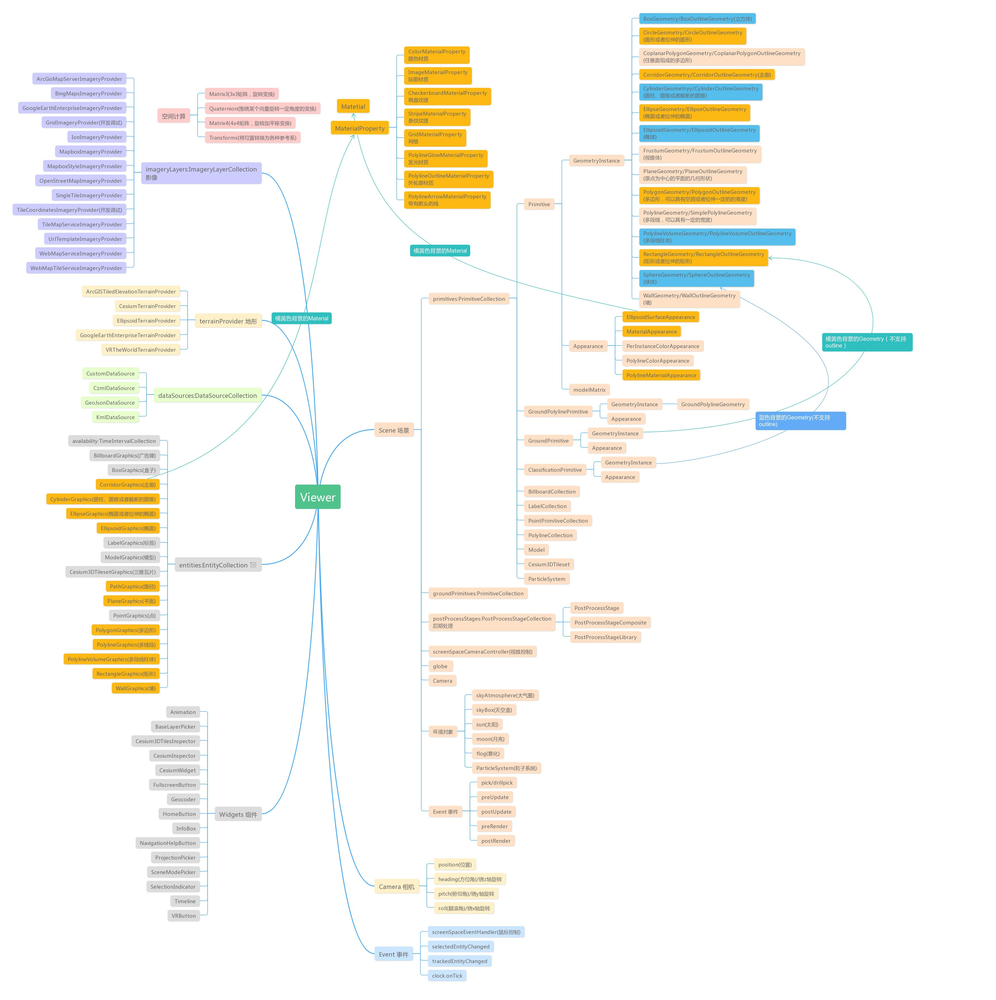

## 1、Cesium 源码下载

[Cesium 源码](https://github.com/CesiumGS/cesium)

> Tags -> 选择需要的版本下载

## 2、Cesium-products 下载

[Cesium 官网](https://cesium.com/platform/cesiumjs/)

> Platform -> downloads

## 3、Cesium Api

