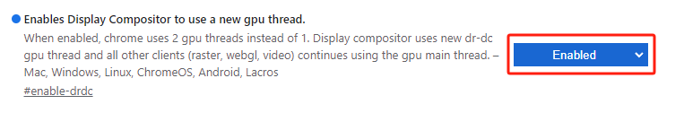
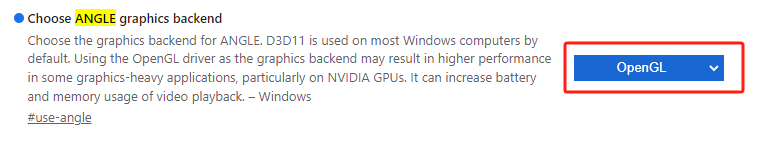

# Win7 环境下可能遇到的 WebGL 错误

## 1、WebGL 2.0

- 目前，大多数主流显示器都支持 `WebGL 2.0`，因为 `WebGL 2.0` 的支持主要依赖于浏览器的实现，而不是显示器本身。‌
- 然而，有一些特定的硬件配置或旧版本的浏览器可能不支持 `WebGL 2.0`。
- `Chrome 浏览器`在默认情况下也不支持 WebGL，需要通过特定设置启用`GPU加速`才能使用 WebGL 功能

  

- 如出现如下错误，请检查

  - 1、浏览器是否支持`WebGL 2.0`
  - 2、独立显卡驱动是否正常安装
  - 3、如无需使用防务相关模块，可以使用 cesium 的 webgl 转译接口，在 viewer 中添加`contextOptions: {requestWebgl1: true}`

  

## 2、Chrome 浏览器配置

- 若独显驱动正常安装，仍报错，则首先考虑通过`更换浏览器`解决
- 若如法更换浏览器，则在 chrome 浏览器中输入`chrome://flags`，进行如下配置

  - GPU 加速：允许显示合成器使用新的 gpu 线程
  - 选择使用`OpenGL`这种`图形渲染后端`来处理浏览器的`图形渲染任务`

  

  

## 3、OpenGL 和 D3D 简介

- OpenGL（Open Graphics Library），开放的图形程序接口，适合专业的 `3D 设计领域`。

  - 微软曾经多次试图排挤 `OpenGL` 在游戏领域的地位，但始终未能如愿以偿。反而越来越多的游戏公司联名要求微软在其操作系统中加入对 `OpenGL` 的支持。这 导致了微软最终的妥协 — 在其与 SGI 联合发表的一份声明中，表示将就 OpenGL 在 Windows 中的应用与后者进行更广泛的合作，在以后的 `DirectX` 体系中，`OpenGL` 将会获得和 `D3D` 一样的重视程度。

- D3D（Direct3D），最初是微软为提高 3D 游戏在 `Win95/Win98` 中的性能而开发的显示程序。
