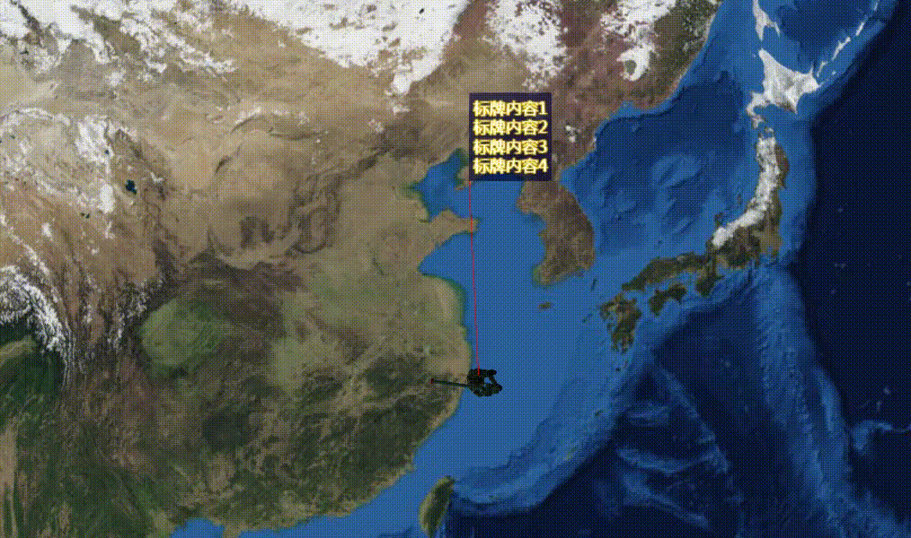

# 可拖拽标牌

## 0、效果



## 1、使用方式

```js
// 引入可拖拽标牌类
import DragLable from './DragLable.js'
// 使用
function addDragLabelEntity() {
  const entity = new Cesium.Entity({
    id: `entity-id`,
    position: Cesium.Cartesian3.fromDegrees(123.0, 30.0, 1000),
    model: {
      show: true,
      uri: './assets/model/warrior.glb',
      scale: 1,
      minimumPixelSize: 128, // 模型的最小像素大小，而不考虑缩放
      distanceDisplayCondition: new Cesium.DistanceDisplayCondition(0.0, 4e8)
    },
    label: new Cesium.LabelGraphics({
      text: `标牌内容1\n标牌内容2\n标牌内容3\n标牌内容4`,
      font: '18px sans-serif',
      style: Cesium.LabelStyle.FILL_AND_OUTLINE,
      fillColor: Cesium.Color.WHITE,
      outlineWidth: 1,
      outlineColor: Cesium.Color.GOLD
    })
  })
  viewer.entities.add(entity)
  // 添加可拖拽标牌
  let table = new DragLable(viewer)
  table.addEntity(entity)
}
```

## 2、可拖拽标牌类`DragLable.js`

```js
export default class DragLable {
  constructor(viewer, options) {
    this._viewer = viewer
    //屏蔽cesium的默认双击追踪选中entity行为
    this._viewer.cesiumWidget.screenSpaceEventHandler.removeInputAction(Cesium.ScreenSpaceEventType.LEFT_DOUBLE_CLICK)
    this._options = {
      labelPixelOffset: new Cesium.Cartesian2(100, -100),
      labelBackgroundColor: Cesium.Color.MIDNIGHTBLUE.withAlpha(0.8),
      dragLineColor: Cesium.Color.GOLD,
      dragLineLength: 100 * 1.414,
      dragLinePixelOffset: new Cesium.Cartesian2(50 - (100 * 1.414) / 2, -50),
      ...options
    }
    this._selectedEntity = undefined
    this._handler = new Cesium.ScreenSpaceEventHandler(this._viewer.scene.canvas)
    // 监听拖动
    this._handler.setInputAction((e) => this.handleLeftDown(e), Cesium.ScreenSpaceEventType.LEFT_DOWN)
    this._handler.setInputAction((e) => this.handleLeftUp(e), Cesium.ScreenSpaceEventType.LEFT_UP)
    this._handler.setInputAction((e) => this.handleMouseMove(e), Cesium.ScreenSpaceEventType.MOUSE_MOVE)
  }
  // 添加可拖拽标牌 - 初始化label、billboard
  addEntity(targetEntity) {
    const canvas = document.createElement('canvas')
    canvas.width = 200 // 画布宽
    canvas.height = 5 // 画布高
    const cxt = canvas.getContext('2d')
    cxt.lineWidth = 5 // 线宽
    cxt.strokeStyle = 'red' // 线颜色
    cxt.moveTo(0, 0) // 定义起点
    cxt.lineTo(200, 0) // 定义连接点
    cxt.stroke() // 把点连起来

    if (targetEntity && targetEntity.label) {
      targetEntity.label.horizontalOrigin = Cesium.HorizontalOrigin.LEFT
      targetEntity.label.verticalOrigin = Cesium.VerticalOrigin.BOTTOM
      targetEntity.label.backgroundPadding = new Cesium.Cartesian2(5, 10)
      targetEntity.label.disableDepthTestDistance = Number.POSITIVE_INFINITY
      targetEntity.label.pixelOffset = this._options.labelPixelOffset
      targetEntity.label.showBackground = true
      targetEntity.label.backgroundColor = this._options.labelBackgroundColor
      targetEntity.billboard = {
        image: canvas,
        width: this._options.dragLineLength,
        color: this._options.dragLineColor,
        pixelOffset: this._options.dragLinePixelOffset,
        rotation: Cesium.Math.toRadians(45),
        height: 2,
        scale: 1,
        disableDepthTestDistance: Number.POSITIVE_INFINITY,
        horizontalOrigin: Cesium.HorizontalOrigin.LEFT,
        verticalOrigin: Cesium.VerticalOrigin.BASELINE
      }
    }
  }
  //更新标牌位置
  updateLabelBillboard(clickEntity, delta) {
    let label = clickEntity.label
    let billboard = clickEntity.billboard
    // 判断delta的xy，根据象限处理label和billboard的偏移
    label.pixelOffset = delta
    billboard.width = Math.sqrt(Math.pow(delta.x, 2) + Math.pow(delta.y, 2))
    billboard.rotation = Cesium.Math.toRadians(-Math.atan(delta.y / delta.x) * (180 / Math.PI))
    if (delta.x >= 0 && delta.y >= 0) {
      // 右下
      label.verticalOrigin = Cesium.VerticalOrigin.TOP
      label.backgroundPadding = new Cesium.Cartesian2(5, 8)
      billboard.horizontalOrigin = Cesium.HorizontalOrigin.LEFT
      billboard.verticalOrigin = Cesium.VerticalOrigin.BASELINE
      billboard.pixelOffset = new Cesium.Cartesian2(delta.x / 2 - billboard.width / 2, delta.y / 2)
    } else if (delta.x > 0 && delta.y < 0) {
      //右上
      label.verticalOrigin = Cesium.VerticalOrigin.BOTTOM
      label.backgroundPadding = new Cesium.Cartesian2(5, 10)
      billboard.horizontalOrigin = Cesium.HorizontalOrigin.LEFT
      billboard.verticalOrigin = Cesium.VerticalOrigin.BOTTOM
      billboard.pixelOffset = new Cesium.Cartesian2(delta.x / 2 - billboard.width / 2, delta.y / 2)
    } else if (delta.x < 0 && delta.y < 0) {
      //左上
      label.verticalOrigin = Cesium.VerticalOrigin.BOTTOM
      label.backgroundPadding = new Cesium.Cartesian2(5, 10)
      billboard.horizontalOrigin = Cesium.HorizontalOrigin.RIGHT
      billboard.verticalOrigin = Cesium.VerticalOrigin.BOTTOM
      billboard.pixelOffset = new Cesium.Cartesian2(delta.x / 2 + billboard.width / 2, delta.y / 2)
    } else if (delta.x < 0 && delta.y > 0) {
      //左下
      label.verticalOrigin = Cesium.VerticalOrigin.TOP
      label.backgroundPadding = new Cesium.Cartesian2(5, 8)
      billboard.horizontalOrigin = Cesium.HorizontalOrigin.RIGHT
      billboard.verticalOrigin = Cesium.VerticalOrigin.BASELINE
      billboard.pixelOffset = new Cesium.Cartesian2(delta.x / 2 + billboard.width / 2, delta.y / 2)
    }
  }
  handleLeftDown(e) {
    //获取当前点击位置的实体对象
    const obj = this._viewer.scene.pick(e.position)
    if (obj && obj.collection) {
      // 锁定相机
      this.cameraControl(false)
      this._selectedEntity = obj.id
    }
  }
  handleLeftUp() {
    this.cameraControl(true)
    this._selectedEntity = undefined
  }
  handleMouseMove(e) {
    if (this._selectedEntity) {
      let cartesian3Pos = this._selectedEntity.position.x ? this._selectedEntity.position : this._selectedEntity.position.getValue()
      //将笛卡尔坐标转为屏幕坐标
      let windowPos = this._viewer.scene.cartesianToCanvasCoordinates(cartesian3Pos)
      if (e.endPosition && e.endPosition.x) {
        //计算移动差值
        const delta = new Cesium.Cartesian2(e.endPosition.x - windowPos.x, e.endPosition.y - windowPos.y)
        this.updateLabelBillboard(this._selectedEntity, delta)
      }
    }
  }
  cameraControl(enable) {
    this._viewer.scene.screenSpaceCameraController.enableTranslate = enable
    this._viewer.scene.screenSpaceCameraController.enableInputs = enable
  }
  //销毁资源
  destroy() {
    this._handler.removeInputAction(Cesium.ScreenSpaceEventType.LEFT_DOWN)
    this._handler.removeInputAction(Cesium.ScreenSpaceEventType.LEFT_UP)
    this._handler.removeInputAction(Cesium.ScreenSpaceEventType.MOUSE_MOVE)
    this._handler = undefined
    this._selectedEntity = undefined
  }
}
```
