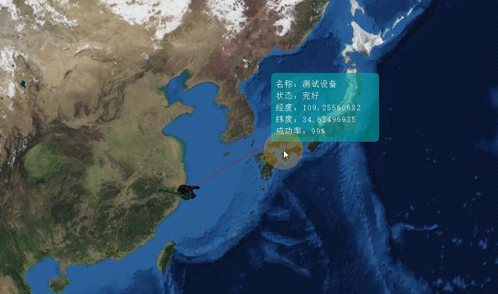

# 可拖拽标牌 2.0

- `Cesium > label`的效果不太好看，改为用 dom 做标牌

## 0、效果



## 1、使用方式

```js
// 引入可拖拽标牌类
import DragDiv from './DragDiv.js'
// 使用
const dataSource = new Cesium.CustomDataSource('label-datasource') // 单独存储标牌的数据源
function addDragLabelEntity() {
  const entity = new Cesium.Entity({
    id: `entity-id`,
    position: Cesium.Cartesian3.fromDegrees(123.0, 30.0, 1000),
    model: {
      show: true,
      uri: './assets/model/warrior.glb',
      scale: 1,
      minimumPixelSize: 128, // 模型的最小像素大小，而不考虑缩放
      distanceDisplayCondition: new Cesium.DistanceDisplayCondition(0.0, 4e8)
    }
  })
  dataSource.entities.add(entity)
  // 添加可拖拽标牌
  let table = new DragDiv(viewer, dataSource)
  table.addEntity(entity, {
    details: [
      { label: '名称：', value: '测试设备' },
      { label: '状态：', value: '完好' },
      { label: '经度：', value: '109.25560682' },
      { label: '纬度：', value: '34.63496935' },
      { label: '成功率：', value: '99%' }
    ]
  })
}
```

## 2、可拖拽标牌类`DragDiv.js`

```js
export default class DragDiv {
  constructor(viewer, dataSource, options) {
    this._viewer = viewer
    this._options = {
      labelPixelOffset: new Cesium.Cartesian2(100, -100),
      dragLineColor: Cesium.Color.GOLD,
      dragLineLength: 100 * 1.414,
      dragLinePixelOffset: new Cesium.Cartesian2(50 - (100 * 1.414) / 2, -50),
      ...options
    }
    // 存放entity的数据源
    this._dataSource = dataSource
    // 正在拖拽标牌
    this._isDragging = false
    // 需要一个label位置缓存(结构：[{id: 'entity的ID=label的id', delta: 'label相对于entity的偏移值'}])
    this._cacheList = new Cesium.AssociativeArray() // 键值对的集合，存储为散列以便于查找，但也提供了一个用于快速迭代的数组。
    this._viewer.clock.onTick.addEventListener(this.calcLablePositions, this) // 监听
    // 样式 -> 使用的时候可把此段样式分离出去
    const style = document.createElement('style')
    style.textContent = `
      .LabelPlotBeautiful-container {
        position: absolute;
        color: white;
        border-radius: 8px 8px 8px 0;
        padding: 10px;
        width: 200px;
        background: rgba(3, 170, 170, 0.6);
        user-select: none;
      }
      .LabelPlotBeautiful-content {
        left: 0;
        bottom: 0;
        cursor: default;
      }
      .LabelPlotBeautiful-info-item {
        letter-spacing: 2px;
        font-family: serif;
      }
    `
    document.head.appendChild(style)
  }
  // 添加可拖拽标牌 - 初始化label、billboard
  addEntity(targetEntity, info) {
    const canvas = document.createElement('canvas')
    canvas.width = 200 // 画布宽
    canvas.height = 5 // 画布高
    const cxt = canvas.getContext('2d')
    cxt.lineWidth = 5 // 线宽
    cxt.strokeStyle = 'red' // 线颜色
    cxt.moveTo(0, 0) // 定义起点
    cxt.lineTo(200, 0) // 定义连接点
    cxt.stroke() // 把点连起来
    targetEntity.billboard = {
      image: canvas,
      width: this._options.dragLineLength,
      color: this._options.dragLineColor,
      pixelOffset: this._options.dragLinePixelOffset,
      rotation: Cesium.Math.toRadians(45),
      height: 2,
      scale: 1,
      disableDepthTestDistance: Number.POSITIVE_INFINITY,
      horizontalOrigin: Cesium.HorizontalOrigin.LEFT,
      verticalOrigin: Cesium.VerticalOrigin.BASELINE
    }
    // 添加自定义label
    const { details } = info
    const newDiv = document.createElement('div')
    newDiv.classList.add('LabelPlotBeautiful-container')
    newDiv.id = `${targetEntity.id}`
    newDiv.innerHTML = createHtml()
    this._viewer.container.append(newDiv)
    function createHtml() {
      let html = `<div class="LabelPlotBeautiful-content">`
      details.forEach((item) => {
        html += `<div class="LabelPlotBeautiful-info-item">${item.label}${item.value}</div>`
      })
      html += `</div>`
      return html
    }
    this._cacheList.set(targetEntity.id, this._options.labelPixelOffset) // 将初始偏移存入_cacheList中
    // 计算场景中所有label的位置
    this.calcLablePositions()
    // 监听label拖动
    const that = this
    newDiv.onmousedown = function (ev) {
      that._isDragging = true
      const { clientX: x1, clientY: y1 } = ev // 鼠标按下时的坐标
      const { offsetLeft: l, offsetTop: t } = newDiv
      let distanceX = 0 // 拖动的x轴距离
      let distanceY = 0 // 拖动的y轴距离
      const { x: oldX, y: oldY } = that._cacheList.get(targetEntity.id)
      document.onmousemove = function (e) {
        const { clientX: x2, clientY: y2 } = e
        distanceX = x2 - x1
        distanceY = y2 - y1
        newDiv.style.left = `${distanceX + l}px`
        newDiv.style.top = `${distanceY + t}px`
        that.updateBillboard(targetEntity, { x: distanceX + oldX, y: distanceY + oldY })
        that._cacheList.set(targetEntity.id, { x: distanceX + oldX, y: distanceY + oldY })
      }
      document.onmouseup = function (ev) {
        that._isDragging = false
        document.onmousemove = null
        document.onmouseup = null
      }
    }
  }
  // 更新拖拽线位置
  updateBillboard(clickEntity, delta) {
    let billboard = clickEntity.billboard
    // 判断delta的xy，根据象限处理billboard的偏移
    billboard.width = Math.sqrt(Math.pow(delta.x, 2) + Math.pow(delta.y, 2))
    billboard.rotation = Cesium.Math.toRadians(-Math.atan(delta.y / delta.x) * (180 / Math.PI))
    if (delta.x >= 0 && delta.y >= 0) {
      // 右下
      billboard.horizontalOrigin = Cesium.HorizontalOrigin.LEFT
      billboard.verticalOrigin = Cesium.VerticalOrigin.BASELINE
      billboard.pixelOffset = new Cesium.Cartesian2(delta.x / 2 - billboard.width / 2, delta.y / 2)
    } else if (delta.x > 0 && delta.y < 0) {
      //右上
      billboard.horizontalOrigin = Cesium.HorizontalOrigin.LEFT
      billboard.verticalOrigin = Cesium.VerticalOrigin.BOTTOM
      billboard.pixelOffset = new Cesium.Cartesian2(delta.x / 2 - billboard.width / 2, delta.y / 2)
    } else if (delta.x < 0 && delta.y < 0) {
      //左上
      billboard.horizontalOrigin = Cesium.HorizontalOrigin.RIGHT
      billboard.verticalOrigin = Cesium.VerticalOrigin.BOTTOM
      billboard.pixelOffset = new Cesium.Cartesian2(delta.x / 2 + billboard.width / 2, delta.y / 2)
    } else if (delta.x < 0 && delta.y > 0) {
      //左下
      billboard.horizontalOrigin = Cesium.HorizontalOrigin.RIGHT
      billboard.verticalOrigin = Cesium.VerticalOrigin.BASELINE
      billboard.pixelOffset = new Cesium.Cartesian2(delta.x / 2 + billboard.width / 2, delta.y / 2)
    }
  }
  // 计算label位置[delta是相对于entity的偏移值]
  calcLablePositions() {
    if (this._isDragging) return // 拖拽label过程中不计算
    const allKeys = Object.keys(this._cacheList._hash)
    allKeys.forEach((key) => {
      const delta = this._cacheList.get(key)
      const entity = this._dataSource.entities.getById(key)
      const div = document.getElementById(key)
      if (entity) {
        const C3 = entity.position.x ? entity.position : entity.position.getValue()
        const windowPos = this._viewer.scene.cartesianToCanvasCoordinates(C3)
        if (windowPos && div) {
          div.style.left = `${windowPos.x + delta.x}px`
          div.style.top = `${windowPos.y - div.offsetHeight + delta.y}px`
        }
      } else {
        this._cacheList.remove(key)
      }
    })
  }
  //销毁资源
  destroy() {
    this._viewer.clock.onTick.removeEventListener(this.calcLablePositions, this)
  }
}
```
