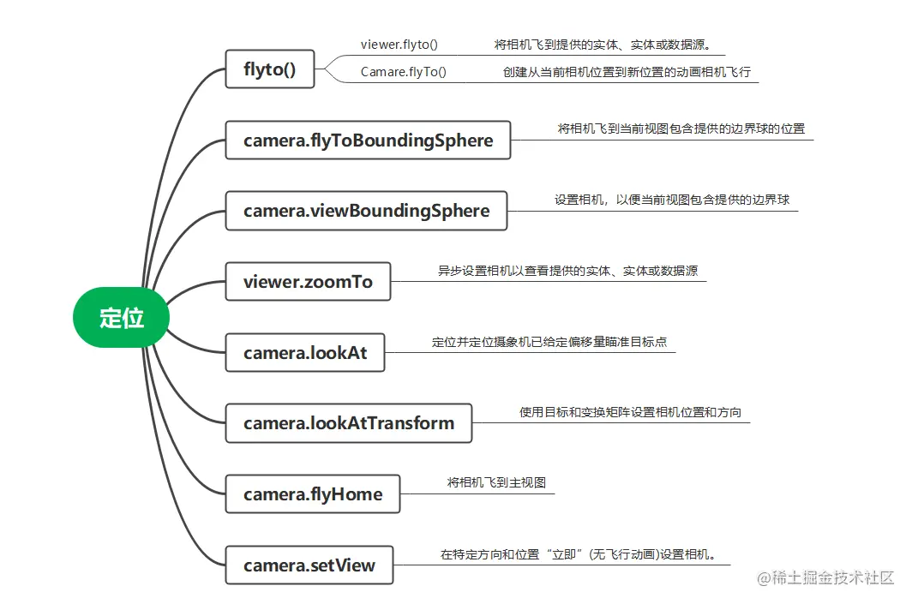

## 目录

[Camera 类](#1camera-类)

[setView](#2setview)

[flyTo](#3flyto)

[lookat](#4lookat)



## 1、Camera 类

**Camera 类描述了相机的当前状态，包括 位置（ position）,朝向（ orientation）,参考空间（ reference frame）,视锥体（view frustum）。**

- `move* 和zoom*` 方法的作用：沿着相机方向或者某个给定向量来平移相机的位置。 相机朝向不变。
- `look* 和 twist*` 方法的作用：旋转相机朝向，向前向量（direction），向上向量（up），向右向量（right）都会改变。相机位置保持不变。
- `rotate*` 方法的作用：相对一个给定的向量，旋转相机的位置和朝向。

  ```js
  // 修改相机位置，设置一个对象位置或者范围:
  var west = Cesium.Math.toRadians(-77.0);
  var south = Cesium.Math.toRadians(38.0);
  var east = Cesium.Math.toRadians(-72.0);
  var north = Cesium.Math.toRadians(42.0);
  var extent = new Cesium.Extent(west, south, east, north);
  camera.viewExtent(extent, Cesium.Ellipsoid.WGS84);
  ```

  ```js
  // 根据一个屏幕坐标创建一个从相机位置发出的射线。在拾取过程中非常有用
  // 计算相机射线和椭球体相交点
  var ray = camera.getPickRay(mousePosition);
  var intersection = Cesium.IntersectionTests.rayEllipsoid(
    ray,
    Cesium.Ellipsoid.WGS84
  );
  ```

  ```js
  //viewer上的方法。 target:定位到的实体、实体集合、数据源等。 offset：从本地东西北上参考框架中实体中心的偏移量
  viewer.zoomTo(pointEntity, new Cesium.Cartesian3(0.0, -4790000.0, 3930000.0));
  ```

## 2、setView

- 没有空中飞行的过程，适合快速切换视角.
- 使用`setView` 方法可以设置相机位置和朝向，需要传递的参数是目标点和朝向。
- `位置`参数需要传一个 Cartesian3 或者 Rectangle 类的实例。
- `朝向`要么是 `heading/pitch/roll 欧拉角` ，要么是 `朝向向量/向上向量`。

  - heading/pitch/roll 的单位是弧度。
    - Heading 是当前方向 由北向东旋转的角度。
    - Pitch 是方向和水平平面的夹角。Pitch 为正 表示方向向量指向水平平面上方，反之表示方向向量指向平面下方。
    - Roll 是方向向量以正东方向为轴的旋转角度。

  ```js
  camera.setView({
    destination: new Cesium.Cartesian3(x, y, z),
    orientation: {
      heading: headingAngle,
      pitch: pitchAngle,
      roll: rollAngle,
    },
  });
  ```

  ```js
  // 位置属性也可以设置为一个矩形区域
  viewer.camera.setView({
    destination: Cesium.Rectangle.fromDegrees(west, south, east, north),
    orientation: {
      heading: headingAngle,
      pitch: pitchAngle,
      roll: rollAngle,
    },
  });
  ```

  ```js
  // 把相机垂直向下俯视，Heading设置为正北方向是最常见的设置参数
  camera.setView({
    destination: Cesium.Cartesian3.fromDegrees(longitude, latitude, height),
    orientation: {
      heading: 0.0,
      pitch: -Cesium.Math.PI_OVER_TWO,
      roll: 0.0,
    },
  });
  ```

## 3、flyTo

- flyTo 则是有相机空中飞行的过程，可以设置飞行时间
- 让相机飞到对应的位置

  ```js
  viewer.camera.flyTo({
    destination: Cesium.Cartesian3.Cartesian3(
      -3961951.57557,
      3346492.0945,
      3702340.5336
    ), //笛卡尔坐标
    orientation: {
      heading: Cesium.Math.toRadians(0.0), // 正北
      pitch: Cesium.Math.toRadians(0.0), // 平视
      roll: 0.0,
    },
    duration: 2, // 2s
  });
  ```

  ```js
  // 飞到相机位置并确定相机姿态
  viewer.camera.flyTo({
    destination: Cesium.Cartesian3.fromDegrees(86.889, 27.991, 4000), // 确定相机位置-经纬度坐标
    orientation: {
      direction: new Cesium.Cartesian3(-0.042312, -0.201232, -0.978629), // 相机视线方向相对于世界坐标的单位向量
      up: new Cesium.Cartesian3(-0.479345, -0.855321, 0.1966022), // 相机的up方向单位向量
    },
  });
  ```

## 4、flytoBoundingSphere

- 将相机移到当前视图包含所提供的包围球的位置

  ```js
  const boundingSphere = new Cesium.BoundingSphere(
    new Cesium.Cartesian3.fromDegrees(107.82, 36),
    100000
  ); //(center,radius)边界球中心点，边界球半径
  viewer.camera.flyToBoundingSphere(boundingSphere, { duration: 3 });
  ```

## 5、lookAt

- 相机以某个位置为中心来确定位置和姿态
- 可以使用两个函数`lookAt(target, offset)`、`lookAtTransform(transform, offset)`
- lookAt

  ```js
  // 通过笛卡尔坐标偏移量确定相机位置角度
  const center = Cesium.Cartesian3.fromDegrees(-98.0, 40.0); //定义视野中心
  viewer.camera.lookAt(
    center,
    new Cesium.Cartesian3(0.0, -4790000.0, 3930000.0)
  ); //定义相机相对于中心点的笛卡尔坐标偏移量
  ```

  ```js
  // 通过HeadingPitchRange确定相机位置角度
  const center = Cesium.Cartesian3.fromDegrees(-72.0, 40.0); //定义视野中心
  const heading = Cesium.Math.toRadians(50.0); //定义相机heading
  const pitch = Cesium.Math.toRadians(-20.0); //定义相机pitch
  const range = 5000.0; //定义相机距离中心点的距离
  viewer.camera.lookAt(
    center,
    new Cesium.HeadingPitchRange(heading, pitch, range)
  );
  ```

- lookAtTransform

  ```js
  // 1. Using a cartesian offset
  const transform = Cesium.Transforms.eastNorthUpToFixedFrame(
    Cesium.Cartesian3.fromDegrees(-98.0, 40.0)
  );
  viewer.camera.lookAtTransform(
    transform,
    new Cesium.Cartesian3(0.0, -4790000.0, 3930000.0)
  );
  ```

  ```js
  // 2. Using a HeadingPitchRange offset
  const transform = Cesium.Transforms.eastNorthUpToFixedFrame(
    Cesium.Cartesian3.fromDegrees(-72.0, 40.0)
  );
  const heading = Cesium.Math.toRadians(50.0);
  const pitch = Cesium.Math.toRadians(-20.0);
  const range = 5000.0;
  viewer.camera.lookAtTransform(
    transform,
    new Cesium.HeadingPitchRange(heading, pitch, range)
  );
  ```

- 相机围绕中心点运动

  ```js
  // Lock camera to a point
  var center = Cesium.Cartesian3.fromRadians(
    2.4213211833389243,
    0.6171926869414084,
    3626.0426275055174
  );
  var transform = Cesium.Transforms.eastNorthUpToFixedFrame(center);
  //相机位置初始化

  viewer.scene.camera.lookAtTransform(
    transform,
    new Cesium.HeadingPitchRange(0, -Math.PI / 8, 2900)
  );

  // 定时任务
  viewer.clock.onTick.addEventListener(function (clock) {
    viewer.scene.camera.rotateRight(0.005);
  });
  ```
