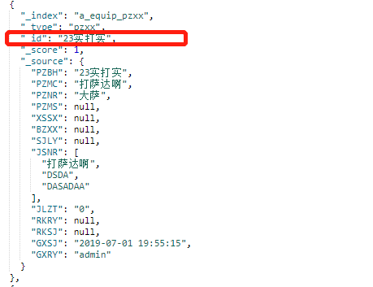
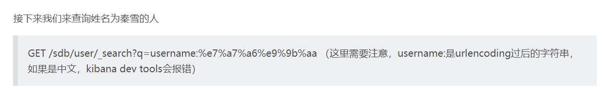
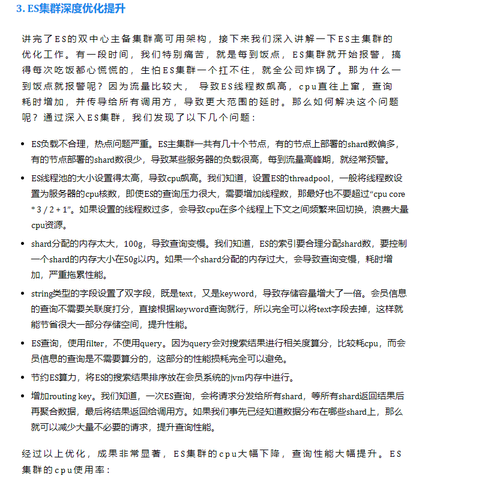

# ES 知识点

## 1、elastic search 中文档的 id 有中文字符无法删除

> 解决：这样删除：`DELETE a_equip_pzxx/pzxx/23%e5%ae%9e%e6%89%93%e5%ae%9e`

## 2、ES 的深度分页问题

> elasticsearch 的深度分页问题，其默认一次查询只能查到前 10000 条数据；解决：使用 scroll

## 3、ES 集群深度优化提升

