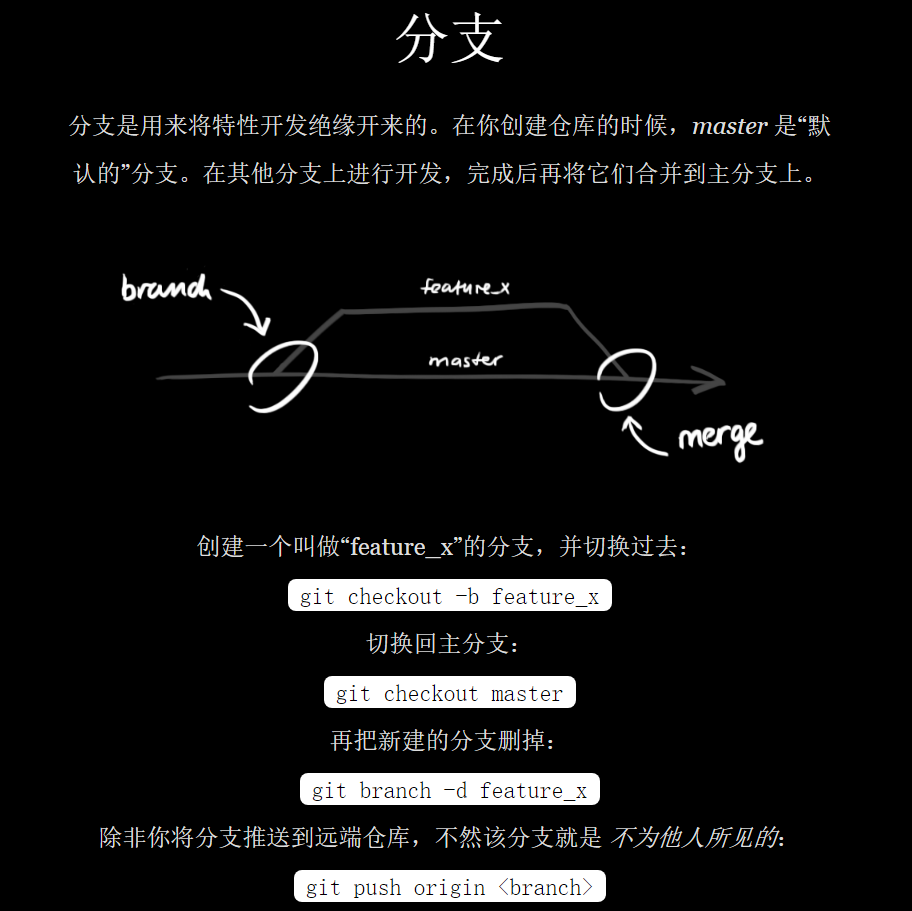
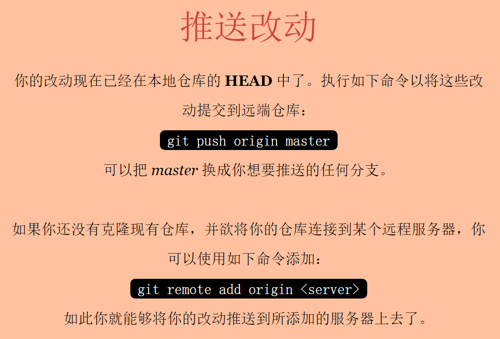
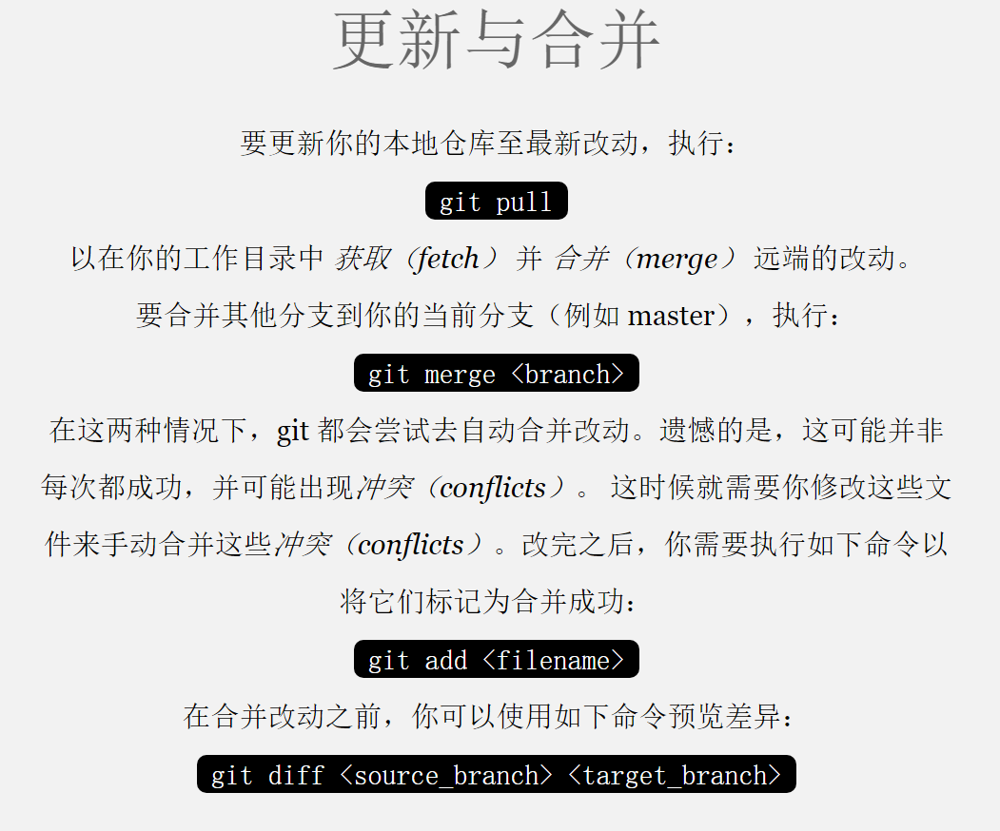
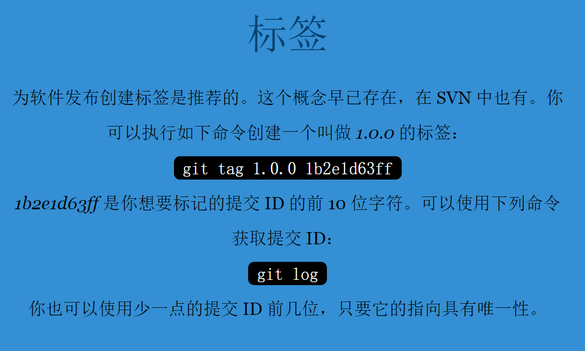

# 命令进阶

## 1、分支

- git 的分支是个`必杀技`，`推荐`创建分支【可不必推送】修改代码：
  - 当你正在创建的`分支a`上修改问题`#1`时，来了个紧急问题`#2`；
  - 你只需要切回`分支master`，创建`分支b`来修复问题`#2`，而不必回退修改问题`#1`时的代码

---

1. `git branch -vv` 【查看所有跟踪分支（需要先 git fetch 一下）】

2. `git checkout -b feature_x` 【创建并检出分支（HEAD 指针将指向 feature_x）】

3. `git merge 待合并分支`

   - 它会把两个分支的最新快照（`C3` 和 `C4`）以及二者最近的共同祖先（`C2`）进行`三方合并`，合并的结果是生成一个新的快照（并`提交`）

4. `冲突+合并`：手动解决下面冲突后`git add + git commit`

   ```js
     <<<<<<< HEAD......
     ......（这里是当前分支的冲突代码）
     =======
     ......（这里是feature_x的冲突代码）
     >>>>>>> feature_x
   ```

5. `git branch -d hotfix` 【合并分支后将不需要的分支删除】

---

6. `git push origin --delete feature_x` 【删除远程分支（从服务器上移除这个指针 feature_x）】

7. `rebase变基`：可保持提交历史的整洁。

   ```bash
   ## 原则：只对尚未推送或分享给别人的本地修改执行变基操作清理历史，从不对已推送至别处的提交执行变基操作
   # 检出（切换）experment分支，并将它变基到master上
   git checkout experiment
   git rebase master
   # 回到master分支，并进行一次快速合并
   git checkout master
   git merge experiment
   ```

## 2、图片介绍









