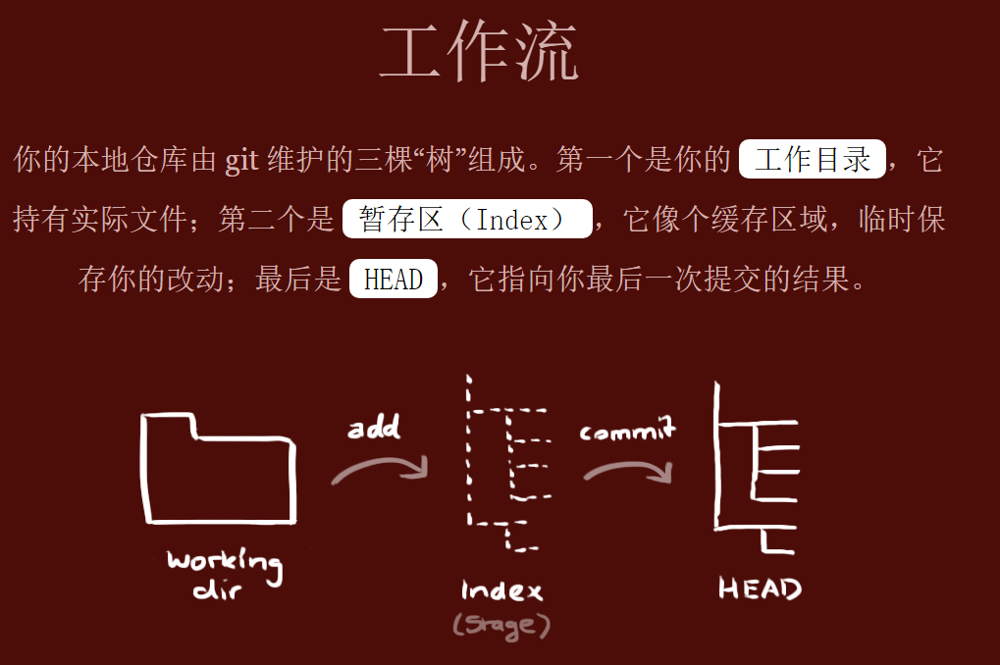

# Git 常用命令

## 1. 打开 git GUI

- gitk

## 2. 常用 git 命令

- `git init` #初始化主分支
- `git clone ...` #克隆远程仓库
- `git clone -b dev ...` # 克隆 dev 分支

---

- `git fetch <远程仓库名> <分支名>` #获取（不会合并）
- `git pull <远程仓库名> <分支名>` #拉取（会合并）

---

- `git add .` #将所有文件提交到暂存区
- `git add b c` #把 b 和 c 存入暂存区
- `git commit -m 备注信息` #提交到本地仓库
- `git commit -am 备注信息` #若本地仓库中已有若干文件，再次提交可简化为此步
- `git push -u origin master` - 推送到远程仓库 origin 的 master 分支(-u 是指在将当前分支与远程分支进行关联)

---

- `git checkout -- xxx` #撤销工作区的修改（eg. git checkout -- readme.md #将本次 readme.md 在工作区的修改撤销掉）
- `git rm 文件名` #将该文件从 commit 后撤回到 add 后

---

- `git diff` #工作区与暂存区的差异
- `git diff --cached` #暂存区与提交版本的差异
- `git show HEAD` #查看最后一次提交修改的详细信息

---

- `git help -a` #查看全部 git 子命令
- `git status` #查看状态
- `git blame xxx` #逐行查看文件 xxx 的修改历史
- `git blame -L 100,10 xxx` #查看从 100 行开始的 10 行文件 xxx 的修改历史

## 3、提交部分代码

- 如有 a、b、c 三个文件，只想提交 a、b 到远程仓库
  - `git add a b`
  - `git stash -u -k` // -u‌：表示包含未跟踪的文件（untracked files）; -k‌：表示保持暂存区的状态不变（keep index）
  - `git commit -m 备注信息`
  - `git push`
  - `git stash pop` // 把之前放入堆栈的 c 拿出来

## 3. 合并 dev 分支代码到 master

- `git checkout master`
- `git merge dev`
- `git push origin master` # 将当前更改推送到远程的 master 分支

## 4. 打 tag

- `git tag -a v1.0.0 -m "..."`
- `git push origin v1.0.0`

## 5. 图片介绍

