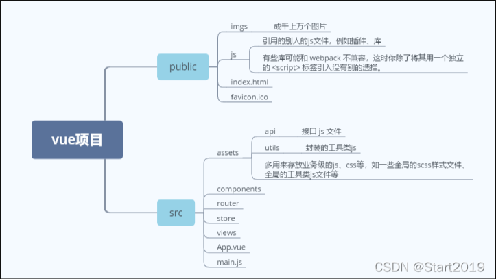

# vue2.0

- vue2.0 的核心：数据驱动（双向绑定）+ 组件化

## 1、vue 实例

- vm（view-model）变量指向 vue 实例，所有的 vue 组件都是 vue 实例
- 只有当实例被创建时存在于 data 选项中的属性才是响应式的
- vue 实例暴露了一些以`$`为前缀的实例属性与方法，以区别用户自定义属性
- 生命周期钩子的`this`指向调用它的 vue 实例。
- 不要在选项属性或回调上使用箭头函数，箭头函数并没有 this。如`created:()=>console.log(this.a)`或`vm.$watch('a', newValue=>this.myMethod())`是错误的。
- 运行顺序

  ```js
  // created -> mounted -> computed -> watch
  // computed 是在`HTML DOM`加载后马上执行的
  // Props -> Methods -> Data -> Computed -> Watch
  ```

## 2、computed 计算属性

- 计算属性是基于他们的响应式依赖进行`缓存`的，不同于方法每次都要进行计算
- 计算属性的`精髓在于缓存`，若不希望有缓存，请用方法替代它

- 若你熟悉虚拟 DOM 并偏爱 JS 的原始力量，可以不使用模板`template`,直接写渲染函数（render），使用可选的 JSX 语法

## 3、class、style 绑定

- 绑定类型：字符串、对象、数组，如`v-bind:class='active'`、`v-bind:class="{active: isActive, 'text-danger': hasError}"`、`v-bind:class="[activeClass, errorClass]"`

## 4、v-if、v-show

- vue 会尽可能高效地渲染元素，通常会复用已有元素而不是从头渲染
- `v-show`适合频繁显示隐藏的元素，改变的是 css 的`display`属性
- `v-show`不支持挂载到`<template>`标签上
- `v-if`适合运行时不经常改变的元素

## 5、v-for

- `v-for`可遍历数组、对象，`v-for="(value,name,index) in object"`,`v-for="(item, index) in items"`

- vue 不能检测到以下两种情况数组的变动：

  - 利用索引直接设置一个数组项，如`vm.items[indexOfItem] = newValue`

    > 解决办法

    ```js
    // Vue.set
    // vm.$set 实例方法，该方法是全局方法 Vue.set 的一个别名
    Vue.set(vm.items, indexOfItem, newValue);
    // Array.prototype.splice
    vm.items.splice(indexOfItem, 1, newValue);
    ```

  - 当你修改数组的长度时，例如：`vm.items.length = newLength`

    > 解决办法

    ```js
    vm.items.splice(newLength);
    ```

- `v-for` 的优先级比 `v-if` 更高，这意味着 v-if 将分别重复运行于每个 v-for 循环中

## 6、事件处理

- `event.stopPropagation()`: 阻止事件冒泡，即不会影响到父级元素
- `event.preventDefault()`: 阻止默认事件，如点击链接后不会发生页面跳转

## 7、组件基础

- 组件是可复用的 vue 实例
- 一个组件的 `data` 选项必须是一个函数，因此每个实例可以维护一份被返回对象的独立的拷贝
- `W3C`标准组件取名：字母全小写，必须包含一个连字符，`kebab-case`
- `$root` 访问根实例
- `$parent`访问父组件实例
- `$refs`访问标记的 dom，在组件渲染完成之后生效，所以应避免在模板或计算属性中使用它

## 8、mixin 混入

- 混入对象是可复用的
- 当组件和混入对象有同名选项时，将以组件优先的方式进行合并；同名钩子函数将合并为一个数组，mixin 的钩子先被调用
- vue 组件可以通过 `this.$options` 对象获取你编写的任何方法

## 9、项目结构


