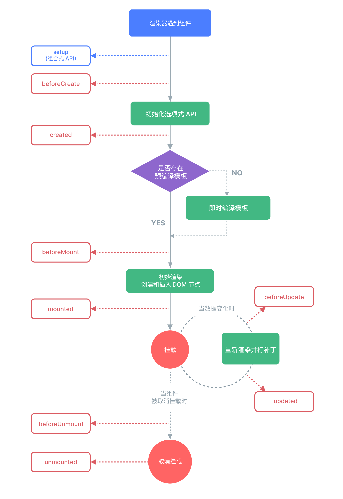

## 1、在同一个页面中创建多个应用实例

```js
const app1 = createApp({
  /* ... */
});
app1.mount("#container-1");

const app2 = createApp({
  /* ... */
});
app2.mount("#container-2");
```

## 2、模板语法

- 同名简写

```html
<!-- 与 :id="id" 相同 -->
<div :id></div>

<!-- 这也同样有效 -->
<div v-bind:id></div>
```

- 动态绑定多个值

```js
const objectOfAttrs = {
  id: "container",
  class: "wrapper",
};
```

```html
<div v-bind="objectOfAttrs"></div>
```

- 动态参数

```html
<!-- 注意，动态参数中表达式的值应当是一个字符串，或者是 null -->
<a v-bind:[attributeName]="url"> ... </a>

<!-- 简写 -->
<a :[attributeName]="url"> ... </a>
```

## 3、响应式基础

- `ref` 将使它的值具有深层响应性，可以持有任何类型的值，包括深层嵌套的对象、数组或者 JavaScript 内置的数据结构，比如 Map.【`shallowRef`退出深层响应性】

```js
// 使用时需要加上 '.value'
import { ref } from "vue";
const count = ref(0);
console.log(count); // { value: 0 }
console.log(count.value); // 0
```

- `reactive` 将使对象本身具有响应性，只能用于对象类型 (对象、数组和如 Map、Set 这样的集合类型)【`shallowReactive`退出深层响应性】

```js
// reactive对解构操作不友好
const state = reactive({ count: 0 });
// 当解构时，count 已经与 state.count 断开连接
let { count } = state;
// 不会影响原始的 state
count++;
```

## 4、class\style 绑定

- 可以直接绑定一个对象

```js
const classObject = reactive({
  active: true,
  "text-danger": false,
});
```

```html
<div :class="classObject"></div>
```

- 如果你的组件有多个根元素，你将需要指定哪个根元素来接收这个 class。你可以通过组件的 $attrs 属性来实现指定

```html
<!-- MyComponent 模板使用 $attrs 时 -->
<p :class="$attrs.class">Hi!</p>
<span>This is a child component</span>
```

```html
<MyComponent class="baz" />
```

## 5、条件渲染

- `v-show` 不支持在 `<template>` 元素上使用
- 当 `v-if` 和 `v-for` 同时存在于一个元素上的时候，`v-if` 会首先被执行

## 6、列表渲染

- `[数组]`可以在定义 v-for 的变量别名时使用解构，和解构函数参数类似

```html
<li v-for="{ message } in items">{{ message }}</li>

<!-- 有 index 索引时 -->
<li v-for="({ message }, index) in items">{{ message }} {{ index }}</li>
```

- `[对象]`可以通过提供第二个参数表示属性名 (例如 key)、第三个参数表示位置索引：

```html
<li v-for="(value, key, index) in myObject">
  {{ index }}. {{ key }}: {{ value }}
</li>
```

## 7、数组变化侦测

- Vue 能够侦听响应式数组的变更方法

```js
// 可以侦听到
push();
pop();
shift();
unshift();
splice();
sort();
reverse();
// 不可侦听到
filter();
concat();
slice();
```

- Vue 实现了一些巧妙的方法来最大化对 DOM 元素的重用，因此用另一个包含部分重叠对象的数组来做替换，仍会是一种非常高效的操作

```js
// `items` 是一个数组的 ref
items.value = items.value.filter((item) => item.message.match(/Foo/));
```

- 在计算属性中使用 reverse() 和 sort() 的时候务必小心！这两个方法将变更原始数组，计算函数中不应该这么做。请在调用这些方法之前创建一个原数组的副本

```js
- return numbers.reverse() // 会改变原始数组
+ return [...numbers].reverse() // 请用ES6新语法扩展运算符'...'进行复制处理
```

## 8、事件处理

- 模板编译器会通过检查 v-on 的值是否是合法的 JavaScript 标识符或属性访问路径来断定是何种形式的事件处理器。
  - 方法事件处理器
  ```js
  foo;
  foo.bar;
  foo["bar"];
  ```
  - 内联事件处理器
  ```js
  foo();
  count++;
  ```
- 在方法事件处理器中访问原生 DOM 事件

```js
function greet(event) {
  // `event` 是 DOM 原生事件
  if (event) {
    alert(event.target.tagName);
  }
}
```

```html
<!-- `greet` 是上面定义过的方法名 -->
<button @click="greet">Greet</button>
```

- 在内联事件处理器中访问原生 DOM 事件

```html
<!-- 使用特殊的 $event 变量 -->
<button @click="warn('Form cannot be submitted yet.', $event)">Submit</button>
<!-- 使用内联箭头函数 -->
<button @click="(event) => warn('Form cannot be submitted yet.', event)">
  Submit
</button>
```

## 9、表单输入绑定

- 将多个复选框绑定到同一个数组或集合

```js
const checkedNames = ref([]);
```

```html
<div>Checked names: {{ checkedNames }}</div>

<input type="checkbox" id="jack" value="Jack" v-model="checkedNames" />
<label for="jack">Jack</label>

<input type="checkbox" id="john" value="John" v-model="checkedNames" />
<label for="john">John</label>

<input type="checkbox" id="mike" value="Mike" v-model="checkedNames" />
<label for="mike">Mike</label>
```

## 10、侦听器

`watch 可以侦听的数据源类型`

- 一个 ref (包括计算属性)
- 一个响应式对象
- 一个 getter 函数
- 多个数据源组成的数组

`不能直接侦听响应式对象的属性值`

```js
const obj = reactive({ count: 0 });

// 错误，因为 watch() 得到的参数是一个 number
// 应使用getter函数：() => obj.count
watch(obj.count, (count) => {
  console.log(`count is: ${count}`);
});
```

- 深度侦听大型数据结构时，开销很大。因此请只在必要时才使用 deep，并且要留意性能。
- watchEffect() 可能会比深度侦听器更有效，因为它将只跟踪回调中被使用到的属性，而不是递归地跟踪所有的属性

```js
// 侦听器的【回调】使用与【源】完全相同的响应式状态`todoId`时，可用watchEffect替代watch
watchEffect(
  async () => {
    const response = await fetch(
      `https://jsonplaceholder.typicode.com/todos/${todoId.value}`
    );
    data.value = await response.json();
  },
  {
    flush: "post", // 如果想在侦听器回调中能访问被Vue更新之后的所属组件的DOM
  }
);
```

## 11、模板引用

- 声明的引用必须和模板里的 ref 同名

```html
<script setup>
  import { ref, onMounted } from "vue";
  const input = ref(null);
</script>

<template>
  <input ref="input" />
</template>
```

- 使用了 `<script setup>` 的组件是默认私有的，需要子组件在其中通过 defineExpose 宏显式暴露

```js
import { ref } from "vue";
const a = 1;
const b = ref(2);
// 像 defineExpose 这样的编译器宏不需要导入
// 父组件得到的实例类型为 { a: number, b: number }
// (ref 都会自动解包，和一般的实例一样)
defineExpose({
  a,
  b,
});
```

## 12、组件基础

- 编译宏命令：defineProps、defineEmits，不需要导入

```js
const props = defineProps(["title"]);
const emit = defineEmits(["enlarge-text"]);
console.log(props.title);
emit("enlarge-text");
```

## 13、生命周期


