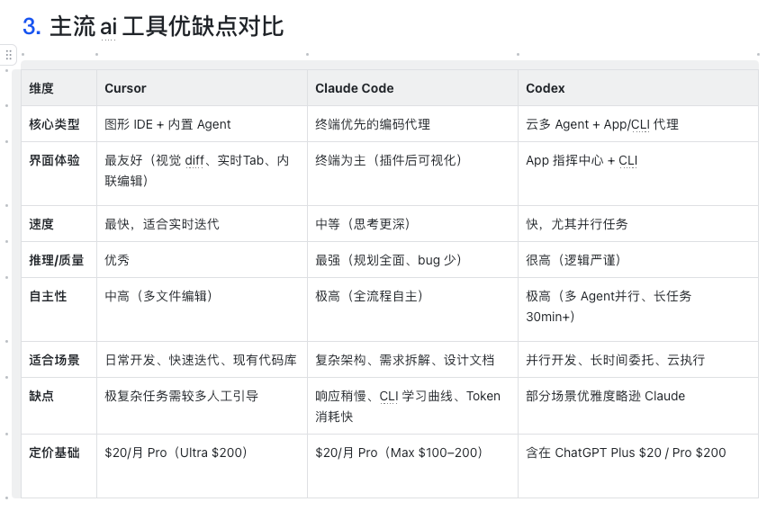

# AI

- [AI提效仿案](https://taosdata.feishu.cn/wiki/Mo8bwio8aiKEiyk5s3IcnXq2nTe)

- [AI 工具选型与 AI Workflow 的最佳实践](https://taosdata.feishu.cn/wiki/CIBNwXMjZirmv2k2UGzcDB3VnQ7)

## 笔记

### 一、目的

- 建立AI知识库：prompt、skills、memory

- 提效，量化AI使用率

### 二、开发流程

- review 提示词

```bash
# 角色设定：“你是一个...，擅长...”
# 任务说明：“”
# 文档内容：粘贴 Functional Spec 的全文。
# 期望输出格式：“请以点列表（Bullet Points）的形式，列出问题、建议和对应的文档修改意见。”
```

- Requirement Spec - 需求文档

- 你是一名：`市场分析师`、`经验丰富的时序数据库产品经理`、`经验丰富的时序数据库领域的产品专家和业务分析师`
- 请扮演一位`TDengine领域的QA专家`

- Functional Spec - 概要设计文档
  - 你是一名`资深的 TDengine 产品设计师和系统分析师`
  - 请扮演一位 `TDengine 用户体验设计师`
  - 请扮演一位 `TDengine 测试工程师`
  - 你是一个`经验丰富的 TDengine 产品经理`，擅长产品概要设计和文档评审。

- Dsign Spec - 详细设计文档
  - 你是一名资深的 TDengine 内核工程师

- Coding + Test - 写代码和测试用例
  - 示例 Prompt：“作为一名`资深的 TDengine 测试工程师`，请分析 TDengine 实时告警功能的 Design Spec，识别所有需要进行的功能测试、性能测试、稳定性测试、兼容性测试和安全性测试点。请重点关注 TDengine 特有的场景，如超级表和子表的告警、流计算与告警的结合、高并发写入下的告警准确性、以及 TDengine 在分布式集群下的数据一致性和容错能力。”

- Test Spec - 测试报告

- User Manual - 用户手册
  - 示例 Prompt：“你是一名擅长技术写作的 TDengine 开发者布道师。请根据提供的 Functional Spec 和 Design Spec，为‘实时告警’功能撰写一份用户手册大纲。文档结构应包含：1. 功能概述（解决什么问题）；2. 核心概念（流计算与告警的关系）；3. 快速入门（由浅入深的 Hello World 示例）；4. SQL 语法参考（详细参数说明）；5. 高级配置（通知模板、静默期）；6. 常见问题与排查。请确保与 TDengine 官方文档风格保持一致。”

### 三、知识库构建

- Prompt 用于生成 Skills：“你是一名 Prompt 工程专家。请基于以下具体 Prompt，提炼一个通用 Skills 模板。原始 Prompt：[粘贴示例] ...。确保模板支持变量替换（如角色、输入、输出），并优化为更高效、精确的版本。评估潜在改进点，如减少歧义、提升输出一致性。”

- 示例 Prompt：“你是一名 AI 知识库审计员。请 Review 以下 Skills 模板和 Memory 条目，评估其与TDengine 最新版本的兼容性、效果指标。建议优化或废弃项，并提出新 Skills 想法。”

- 可以参考开源项目 github/spec-kit 来构建自己的命令集

### 四、AI使用情况统计

- 统计每个人的token使用情况

### 五、AI使用最佳实践和分享

- `LLM`：Claude、Gemini、GPT/Codex
- `AI Agent`：Claude Code 、Codex、Cursor

#### 1、AI IDE、AI Agent工具与大模型的介绍

- 大模型（LLM）: 是整个生态的核心大脑，提供推理、代码生成和规划能力。对于编程能力来说，目前的主流包括：
  1. `Anthropic` 的 Claude 系列（推理深度和代码质量领先）
  2. `OpenAI` 的 GPT/Codex 系列（速度快、多任务并行强）
  3. `Google` 的 Gemini 系列
- `AI IDE`（如 Cursor）：是一个完整的图形化开发环境（VS Code 深度 fork）。它调用大模型，提供实时补全、视觉diff、多文件编辑等功能。Cursor 本身不生产智能，而是将大模型包装成舒适的“驾驶舱”，内置 Composer/Agent 模式，能自主处理一定复杂任务。

- `AI Agent 工具`（如 Claude Code、Codex）：是专为自主执行设计的编码代理（Agentic Coding Tools）。它们依赖大模型，但更侧重全流程自动化：规划任务、读写文件、运行命令、测试迭代、修复 bug。Claude Code 偏向深度思考和高质量输出；Codex 偏向多 Agent 并行和云沙箱长任务。

- 对于不同的 AI Agent、AI IDE、LLM 来讲，擅长的领域各不相同，所以最佳实践应该是我们根据业务场景来选择最适合的 AI 工具，亦或是同一个任务的不同阶段交给最适合的 AI 工具，这样既能最大限度发挥 AI 工具的作用，还能提升效率，节省 tokens。

  
