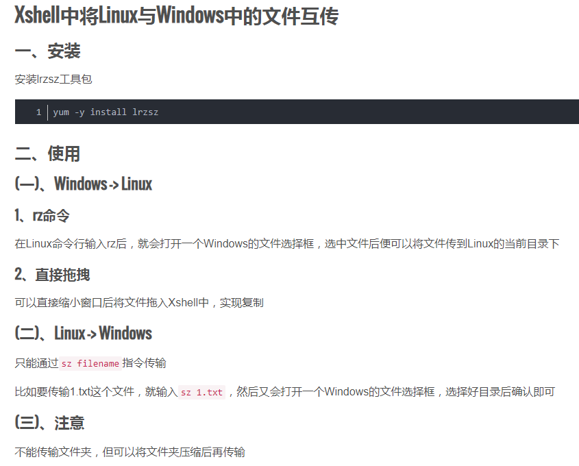

# xshell 中文件传输

## 1、文件传输工具 lrzsz

```bash
# lrzsz工具可以使xshell工具方便地上传下载文件，比使用scp命令方便些
# 有资料说lrzsz工具仅支持4GB以下的文件上传
# 使用root用户进行安装
yum install -y lrzsz
# sz：将选定的文件发送到本地机器，运行命令后会弹出保存位置窗口（send）
# rz：运行该命令会弹出一个文件选择窗口，从本地选择文件上传到服务器(receive)
```


