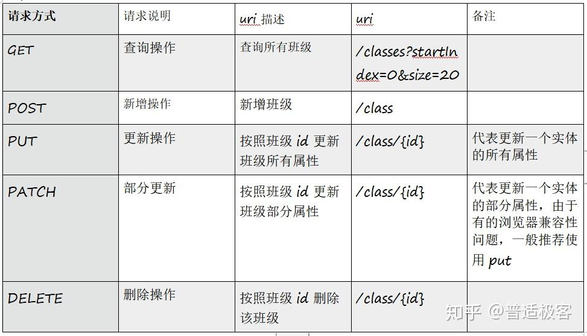

## RestfulApi-总结

- `URL`只指定资源，用 http 方法动词进行不同类型的操作，用 http 状态码定义操作结果

  ```js
  GET http://xxx.com:8080/posts/atricle（查询文章）

  POST http://xxx.com:8080/posts/atricle（新增文章）

  PUT http://xxx.com:8080/posts/atricle（修改文章）

  DELETE http://xxx.com:8080/posts/atricle（删除文章）
  ```

- 请求动作

  
  <!--  -->
