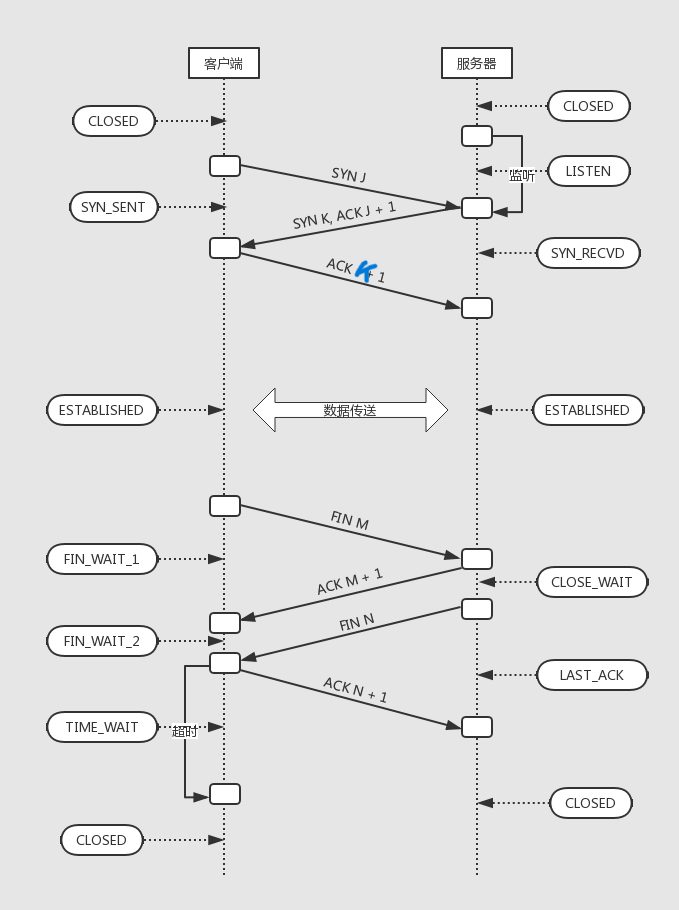
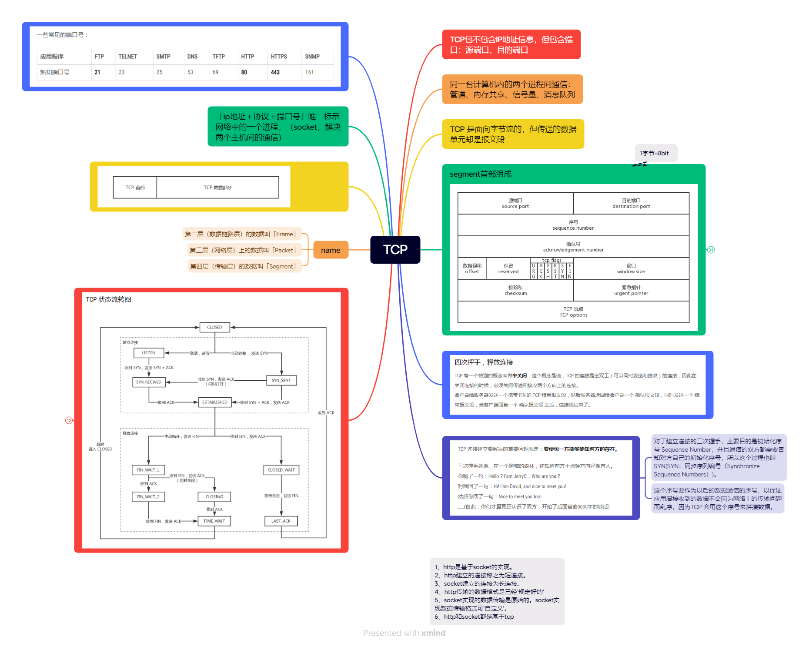
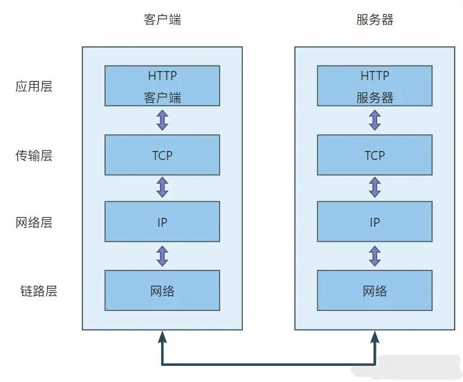
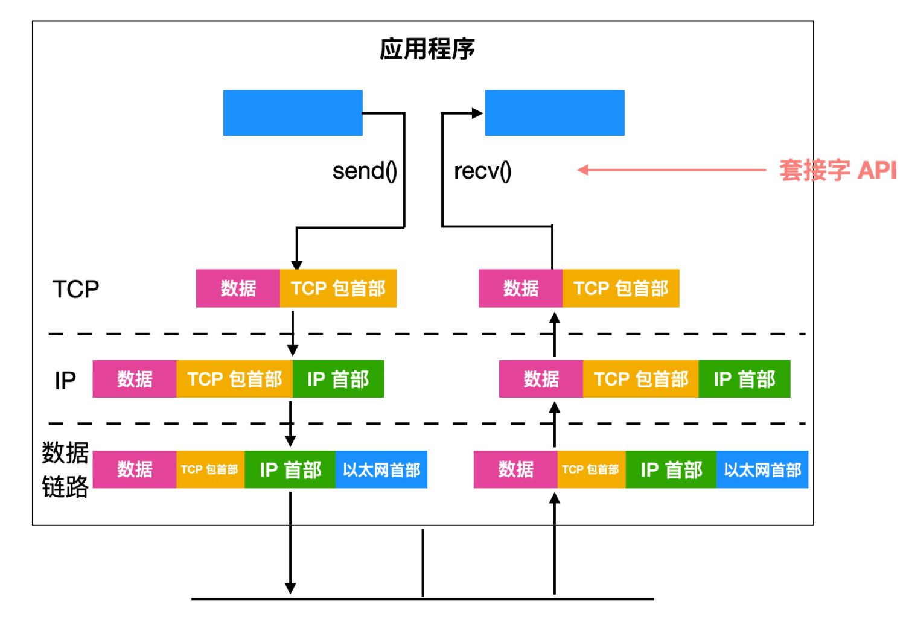

# TCP/IP 协议

## 1. TCP 三次握手

> 三次握手（场景对话版）：客户端：hello，你是 server 么？ 服务端：hello，我是 server，你是 client 么 客户端：yes，我是 client

- 三次握手、四次挥手的作用：`保证数据传输的可靠性`

  - 第一次握手：客户端发送一个带有`SYN`（synchronize 同步）标志的数据包给服务端
  - 第二次握手：服务端接收成功后，回传一个带有`SYN/ACK`标志的确认数据包，表示我收到了
  - 第三次握手：客户端接收成功后，再回传一个带有`ACK`标志的数据包，握手结束

- TCP 三次握手建立连接的过程就是相互确认初始序号的过程，同步序号保证数据传输的可靠性

- 为什么要进行三次握手，而不是两次？
  - 两次握手会出现这种情况：`①` 客户端发出连接请求，但因连接请求报文丢失而未收到确认，于是客户端再重传一次连接请求，而后收到了确认，建立了连接；`②` 数据传输完毕后就释放了连接，此时客户端一共发出两个连接请求报文，其中第一个丢失，第二个到达了服务器，但第一个丢失的报文只是在某个网络节点长时间滞留了，延误到连接释放以后的某个时间点才到达服务器。`③` 此时服务端误以为客户端又发送了一次新的连接请求，于是就向客户端发出确认报文，同意建立连接；`④` 此时客户端忽略服务端发来的确认，也不发送数据，服务端一直等待接收数据，浪费了资源。

## 2. TCP 四次挥手

> 四次挥手（场景对话版）：主动方：我已经关闭了向你那边的主动通道了，只能被动接收了 被动方：收到通道关闭的信息，我这还有数据没有发送完成，你等下 被动方：那我也告诉你，我这边向你的主动通道也关闭了 主动方：最后收到数据，之后双方无法通信

- 四次挥手原理：

  - 第一次挥手：客户端发送一个`FIN`包，用来关闭客户端到服务器的数据传送，并指定一个序列号，客户端进入`FIN_WAIT_1`状态
  - 第二次挥手：服务器收到 FIN 包后，发送一个`ACK`给客户端，确认序号为客户端的序列号值+1，表明已经收到客户端的报文了，服务器进入`CLOSE_WAIT`状态
  - 第三次挥手：服务器发送一个`FIN`包，用来关闭服务器到客户端的数据传送，并指定一个序列号，服务器进入`LAST_ACK`状态
  - 第四次挥手：客户端收到 FIN 包后，进入`TIME_WAIT`状态，接着发送一个`ACK`给服务器，确认序号为收到序号+1，服务器收到确认后进入 CLOSED 状态，四次挥手结束

- 为什么`TIME_WAIT`等待时间是`2MSL`？
  - MSL 是报文最大生存时间，一来一回需要等待 2 倍的时间
  - 最后一次挥手中客户端会等待一段时间再关闭的原因，是为了防止发送给服务器的确认报文段丢失或出错，从而导致服务器端不能正常关闭
- 为什么要四次挥手？
  - TCP 协议的连接是`全双工`的，所以终止连接时需要两个方向都单独关闭。
  - 客户端发送 FIN 报文终止连接后，服务器可能还有数据需要发送，所以服务器会先发送 ACK 报文确认收到 FIN 报文，并将未发送的数据发送出去，然后再发送自己的 FIN 报文终止连接
  - 客户端接收到服务器的 FIN 报文后，也需要发送 ACK 报文确认收到，才能正式关闭连接。

  

  <!--  -->

## 3. TCP/IP 的分层管理：`应用层、运输层、网络层、数据链路层`（不含物理层）

- 为什么要分层：

  - 如果互联网是由一个协议统筹，某个地方需要改变设计时，就必须把所有部分整体替换掉。
  - 而分层之后只需把变动的层替换掉即可，把各层之间的接口部分规划好之后，每个层次内部的设计就能够自由改动了。

- 各层的作用：
  - `应用层（DNS，HTTP协议）`：DNS 将域名解析成 IP 地址，并发送 HTTP 请求
  - `传输层（TCP，UDP）`：建立 TCP 连接，客户端和服务端数据传输就是在这层进行的
  - `网络层（IP，ARP地址解析协议）`：IP 寻址及路由选择，选择一条传输线路
  - `数据链路层`：用来处理连接网络的硬件部分，硬件上的范畴均在链路层的作用范围之内

> 总结：从应用层 DNS 将域名解析成 IP 地址，并发送 HTTP 请求，到传输层通过三次握手建立 TCP 连接，再到网络层的 IP 寻址，再到数据链路层的封装成帧，利用物理介质进行数据传输。

- 数据传输分层解构图：

  

  
