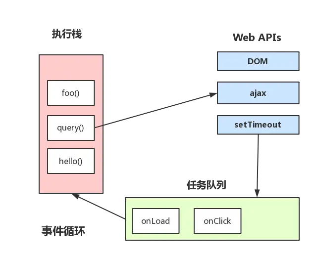
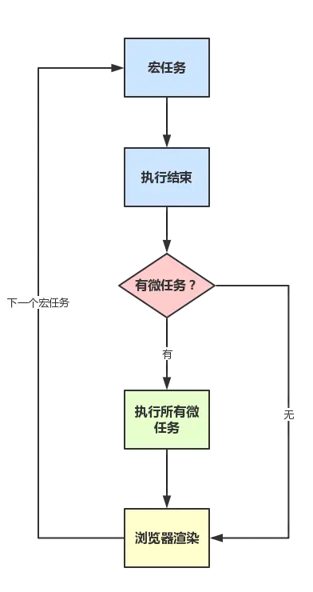
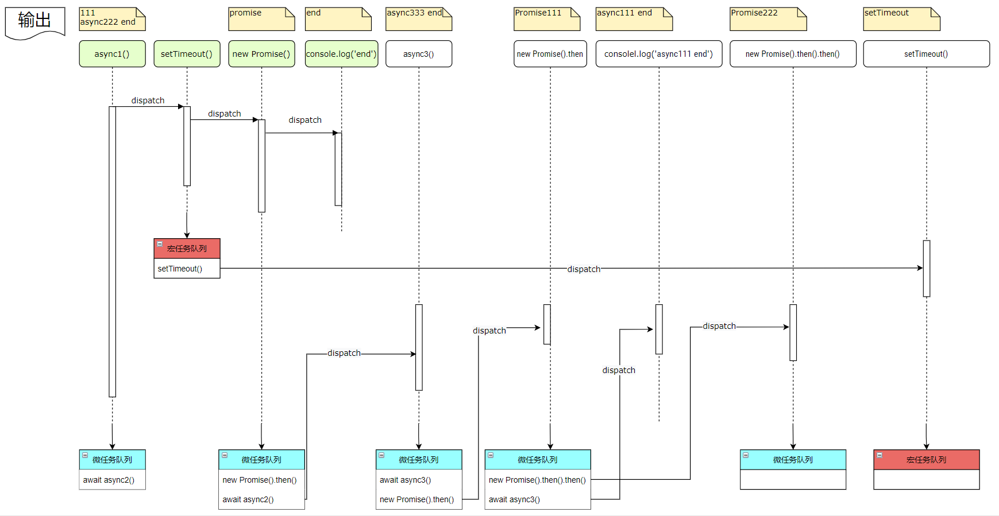

# 总结

[Tasks,microtasks,queues and schedules](https://jakearchibald.com/2015/tasks-microtasks-queues-and-schedules/)

- `Tasks execute in order, and the browser may render between them` 【宏任务按序执行，浏览器可以在它们之间进行渲染】
- `Microtasks execute in order, and are executed:`【微任务按序执行，执行与如下时刻：】
  - `after every callback, as long as no other JavaScript is mid-execution`【每次回调后，只要没有其他 JS 处于执行过程中】
  - `at the end of each task`【在每次宏任务的末尾】

```bash
# 进程是 CPU 资源分配的最小单位（是能拥有资源和独立运行的最小单位）；
# 线程是 CPU 调度和分派的基本单位，共享进程的内存空间和资源，每个线程有自己的栈空间和程序计数器；
# 浏览器每打开一个 tab 页，就是开了一个进程；
```

## 1、Event-Loop 概念

- 事件循环是浏览器或 node 环境执行 js 代码的一种`规则`

- 同步任务都在 `JS 引擎线程`（主线程）上执行，形成一个`执行栈`

- `事件触发线程`管理着一个`任务队列`(宏任务队列)，异步任务有了运行结果，就在任务队列中放置一个事件

- 什么时候用到`定时器触发线程`？当使用`setTimeout`或`setInterval`时，需要定时器触发线程计时，计时完成后就会将特定的事件推入`事件队列`中。

  - `为什么要单独的定时器触发线程`？因为 JavaScript 引擎是单线程的, 如果处于阻塞线程状态就会影响记计时的准确，因此很有必要单独开一个线程用来计时。

- 一旦`执行栈`中的所有同步任务执行完毕（此时 JS 引擎空闲），系统就会读取任务队列，将可运行的异步任务添加到可执行栈中，开始执行。

  > `为什么有时候setTimeout推入的事件不能准时执行`？因为可能在它推入到事件列表时，主线程还不空闲，正在执行其它代码，所以自然有误差。

  - 主线程运行时会产生执行栈，栈中的代码调用某些 api 时，它们会在事件队列中添加各种事件（当满足触发条件后，如 ajax 请求完毕）
  - 而栈中的代码执行完毕，就会读取事件队列中的事件，去执行那些回调
  - 如此循环

    

## 2、宏任务-微任务

- 好文章：[Tasks,microtasks,queues and schedules](https://jakearchibald.com/2015/tasks-microtasks-queues-and-schedules/)

- js 代码分为两类：**同步代码、异步代码**
- 异步代码又分为：**宏任务(macrotask)、微任务(microtask)** ，在 ECMAScript 中`macrotask称为task`、`microtask称为jobs`
- 浏览器会在一个`task`执行结束后，在下一个`task`执行开始前，对页面进行重新渲染
- `microtask` 微任务都是添加到微任务队列（`Job Queues`）中，等待当前 `macrotask` 执行完毕后执行，而这个队列由 `JS引擎线程` 维护

  | 任务                              | 类别         |
  | --------------------------------- | ------------ |
  | 事件                              | 宏任务       |
  | setTimeout                        | 宏任务       |
  | setInterval                       | 宏任务       |
  | setImmediate(Node 独有)           | 宏任务       |
  | requestAnimationFrame(浏览器独有) | 宏任务       |
  | 网络请求                          | 宏任务       |
  | fs.readFile()                     | 宏任务       |
  | UI rendering(浏览器独有)          | 宏任务       |
  | Promise.then()                    | ------微任务 |
  | async/await                       | ------微任务 |
  | process.nextTick(Node 独有)       | ------微任务 |
  | Object.observe                    | ------微任务 |
  | MutationObserve                   | ------微任务 |

## 3、事件循环执行机制

- 进入 script 标签,就进入到第一次事件循环（可看作一个宏任务开始）
- 遇到同步代码立即执行
- 遇到宏任务放到宏任务队列
- 遇到微任务放到微任务队列
- 执行完所有同步代码
- 执行微任务
- 微任务执行完毕，本次主线程执行栈清空，开始检查渲染，然后 `GUI 线程`接管渲染
- 渲染完毕后，`JS引擎线程`继续接管，寻找下一个宏任务,重复上述步骤，这种重复不断的机制，就叫做事件循环

  ```js
  // 我们在一个微任务中使用 setTimeout() 函数添加一个宏任务，那么这个新的宏任务会在当前微任务执行完毕后立即执行，而不是等待当前宏任务执行完毕再执行。
  ```

  

## 4、调用栈

- 调用栈 `call stack` 也叫`执行栈`，记录了当前执行的上下文 `context` 和函数调用链;
- 所有**函数**想要执行就必须经过调用栈，因为调用栈可以理清词法环境、变量环境等;
- 当 js 引擎执行一个函数时，它会将函数的调用信息添加到调用栈的顶部，并在执行完该函数后从调用栈中弹出该函数的信息。如果该函数调用了其他函数，那么这些函数也会依次被添加到调用栈中，并在执行完后弹出。在函数执行期间，调用栈会保持不断增长和收缩的状态。

## 5、示例

```js
async function async1() {
  console.log(111) //1
  await async2() //await会阻塞它下一行的代码
  await async3() //异步代码中的微任务1，先挂起
  console.log('async111 end') //7 微任务3 等async3执行完毕后进入任务队列
}
async function async2() {
  console.log('async222 end') //2
}
async function async3() {
  console.log('async333 end') //5
}
async1()
setTimeout(() => {
  //异步代码中的宏任务1，先挂起
  console.log('setTimeout') //9
}, 0)
new Promise((resolve) => {
  console.log('Promise') //3
  resolve()
})
  .then(() => {
    //异步代码中的微任务2，先挂起
    console.log('Promise111') //6
  })
  .then(() => {
    //异步代码中的微任务4，先挂起  前一个.then的回调函数执行后被进入任务队列
    console.log('Promise222') //8
  })
console.log('end') //4
```


