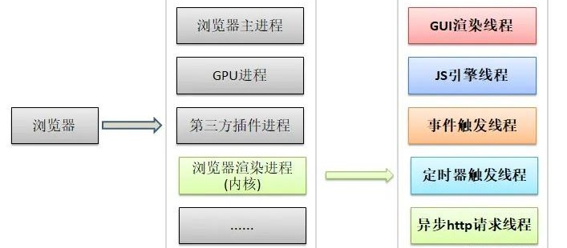
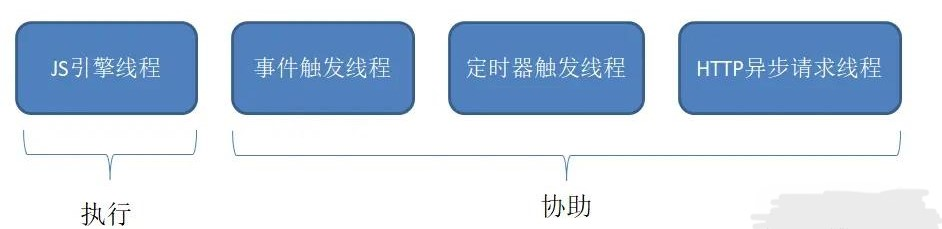
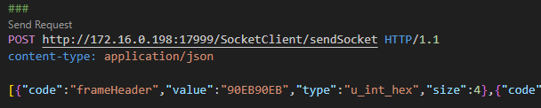

# 网络请求全过程

## 0、浏览器知识

- 浏览器是多进程的，进程包括：

  - `浏览器主进程`（1 个，负责协调、主控）
  - `GPU进程`（1 个，用于 3D 绘制等）
  - `浏览器渲染进程`（tab 页，浏览器内核，内部是多线程的，负责页面渲染、脚本执行、事件处理等）
  - `插件进程`（每种类型的插件对应一个进程）

  > 可通过 chrome`更多工具 > 任务管理器`查看浏览器当前进程

- 浏览器内核是多线程的，包括：

  - `GUI渲染线程`（Graphical User Interface 负责渲染界面，解析 HTML、CSS，构建 DOM 树和 RenderObject 树，布局，绘制；`GUI渲染线程与JS引擎线程是互斥的`）
  - `JS引擎线程`（也叫 JS 内核，负责解析执行 JS 脚本程序的主线程，JS 引擎一直等待着任务队列中任务的到来）
  - `事件触发线程`（负责控制鼠标、键盘等事件，把事件处理函数推进任务队列，等待 JS 引擎线程执行）
    - 归属于浏览器而不是 JS 引擎，用来控制事件循环
  - `定时器触发线程`（主要控制 setInterval、setTimeout，负责将定时器处理函数推进任务队列，等待 JS 引擎线程执行）
    - 浏览器`定时计数器`并不是由 JavaScript 引擎计数的,（因为 JavaScript 引擎是单线程的, 如果处于阻塞线程状态就会影响记计时的准确，所以用单独的线程来计时）
  - `异步http请求线程`（在 XMLHttpRequest 在连接后是通过浏览器新开一个线程请求）
    - 将检测到`状态变更`时，如果设置有回调函数，异步线程就产生状态变更事件，将这个回调再放入事件队列中。再由 JavaScript 引擎执行。

  

- 可以看到，`JS引擎是内核进程中的一个线程`，这也是为什么常说 JS 是单线程的

  - 虽然 JS 是单线程的，但实际工作的线程一共有四个，后三个只是协助，只有 JS 引擎线程是真正执行的：

  

- JS 引擎单线程的原因？

  - JavaScript 最初是作为`浏览器脚本语言`开发的，用来操作 DOM，如果多个线程同时进行 DOM 操作，会出现一些问题（如竞态条件、数据难以同步、复杂的锁逻辑等）
  - JavaScript 虽然是单线程的，但通过` 异步编程模型`和`事件循环机制 `，仍然可以实现高并发处理。`

- GUI 渲染线程与 JS 引擎线程互斥？

  - 由于 JavaScript 是可以操纵 DOM 的，如果在修改这些元素属性的同时渲染界面（即 JS 线程和 UI 线程同时运行），那么渲染线程前后获得的元素数据就可能不一致了。
  - 为了防止渲染出现不可预期的结果，浏览器 GUI 渲染线程与 JS 引擎线程被设计成互斥的关系，当 JS 引擎执行时 GUI 渲染线程会被挂起，GUI 更新则会被保存在一个队列中等到 JS 引擎线程空闲时立即被执行。
  - 这也是就是为什么 JS 执行时间过长，会造成页面渲染不连贯，导致页面出现阻塞的原因。

- 渲染过程中遇到 JS 文件如何处理？

  - JS 的加载、解析、执行会阻塞文档的解析，也就是说 HTML 解析器遇到了 JavaScript，会暂停解析，将控制权移交给 JS 引擎，待 JS 引擎运行完毕，浏览器再从中断的地方继续解析文档。如今，可以通过给 script 标签添加`defer`、`async`属性控制 JS 的加载时机，参见[JS 模块加载](/notes/前端基础/Js模块加载.md)

- 多线程？ `WebWorker` - 处理 cpu 密集型计算

  - JS 引擎是单线程的，且 JS 执行时间过长会导致页面的渲染加载有卡顿的感觉
  - HTML5 中支持了`Web Worker`
  - MDN 官方解释是：

    > Web Worker 为 Web 内容在后台线程中运行脚本提供了一种简单的方法，线程可以执行任务而不干扰用户界面；

    > 一个 worker 是使用一个构造函数创建的一个对象(e.g. Worker()) 运行一个命名的 JavaScript 文件，这个文件包含将在工作线程中运行的代码;

    > workers 运行在另一个全局上下文中,不同于当前的 window，因此，使用 window 快捷方式获取当前全局的范围 (而不是 self) 在一个 Worker 内将返回错误。

  - 创建 Worker 时，JS 引擎向浏览器申请开一个子线程（`子线程是浏览器开的，完全受主线程控制，而且不能操作 DOM`）
  - `JS引擎线程`与`Worker线程`间通过特定的方式通信（worker.postMessage API，需要通过`序列化对象`来与 JS 引擎线程交互特定的数据）
  - `JS引擎是单线程的`，这一点的本质仍然未改变，Worker 可以理解是浏览器给 JS 引擎开的外挂，专门用来解决那些大量计算问题

## 1、URL 解析、DNS 解析（应用层）

- 浏览器接收 url 并开启一个`新进程`

- `URL`（Uniform Resource Locator，统一资源定位符）解析得到：`协议（http/https/FTP）、域名、数据文件路径、查询参数`，生成请求报文

- `DNS`（Domain Name System）域名解析得到 IP：浏览器根据域名从`浏览器缓存 -> 操作系统缓存 -> 本地DNS服务器 -> 根服务器`中查找 IP 地址
  - 每个完整的内网通常都会配置本地 DNS 服务器，例如用户是在学校或工作单位接入互联网，那么用户的本地 DNS 服务器肯定在学校或工作单位里面。

## 2、三次握手建立 TCP 连接，通过网络层发送 IP 包至目标服务器（运输层）

- 添加 TCP 头部：`三次握手` 建立 TCP 连接，对每个数据块添加 TCP 头部

  - 客户端发送 `SYN 包`（同步序列编号）
  - 服务器回应 `SYN-ACK 包`（同步-确认）
  - 客户端再发送 `ACK 包（确认）`，连接建立

- 添加 IP 头部(实现远程定位)：通过路由表得到`源IP地址`，`源IP地址 + 目的IP地址`等信息组成 IP 头部，添加到数据报文中 -> `IP报文`

- 添加 MAC 头部（实现以太网传输）：MAC 包头包含`发送方MAC地址 + 接收方MAC地址`，`发送方MAC地址`是在网卡生产时写入到`ROM`中的,`接收方MAC地址`需要通过`ARP`协议在以太网中以广播的形式获取，最后形成 MAC 包头拼接到数据报文中

- `网卡`将`数字信号`转为`电信号`发送给交换机，`交换机`再转发给`路由器`，然后在路由器中层层跳跃最终到达`目标服务器`

## 3.1、HTTPS 握手（应用层+运输层）

- 浏览器发送服务器 Hello 消息，开始 TLS 握手
- 服务器响应客户端 Hello 消息，发送证书，协商加密算法
- 浏览器验证证书，生成对称加密密钥，双方完成握手

## 3.2、发送 HTTP 请求（应用层+运输层）

- 浏览器构建 http 请求报文，包括：`请求行、请求头header、请求体body`

  - 请求行：包含`请求方法`、`URI`（资源路径）、`HTTP协议版本`
  - 请求头：包含客户端向服务器发送的`附加信息`，如浏览器类型、字符编码、认证信息等，以`键值对`形式存在
  - 请求体：存放`请求参数`，常用于 POST 方法提交时，发送表单数据、JSON 数据等

  | 常用请求头      | 解释                                                                                  |
  | --------------- | ------------------------------------------------------------------------------------- |
  | Accept          | 接收类型，表示浏览器支持的 MIME 类型 （对标服务端返回的 Content-Type）                |
  | Accept-Encoding | 浏览器支持的压缩类型,如 gzip 等,超出类型不能接收                                      |
  | Content-Type    | 客户端发送出去实体内容的类型                                                          |
  | Cache-Control   | 指定请求和响应遵循的缓存机制，如 no-cache                                             |
  | Max-age         | 代表资源在本地缓存多少秒，有效时间内不会请求，而是使用缓存                            |
  | Cookie          | 有 cookie 并且同域访问时会自动带上                                                    |
  | Connection      | 当浏览器与服务器通信时对于长连接如何进行处理,如 keep-alive                            |
  | User-Agent      | 用户客户端的一些必要信息，如 UA 头部等                                                |
  | Origin          | 最初的请求是从哪里发起的（只会精确到端口）,Origin 比 Referer 更尊重隐私               |
  | Referer         | 该页面的来源 URL(适用于所有类型的请求，会精确到详细页面地址，csrf 拦截常用到这个字段) |

  > 请求头的`Content-Type`常见取值:

  ```js
  ;`application/x-www-from-urlencoded` // 以键值对的数据格式提交
  `multipart/form-data` // 用于上传文件图片等二进制数据
  ```

- 将 http 请求封装在 TCP 数据包中通过运输层发送至服务器

- 为什么 HTTP 报文中要存在“空行”

  

  - 因为 HTTP 协议并没有规定报头部分的键值对有多少个，空行就是相当于是`报头的结束标记`或者说`抱头和正文之间的分隔符`
  - HTTP 在传输层依赖 TCP 协议，TCP 是面向`字节流`的，如果没有这个空行，就会出现`粘包`问题。

## 4、服务器处理请求并响应（应用层+运输层）

- 服务器接收请求并处理生成 HTTP 响应，包括：状态码、响应头、响应体

  | 状态码 | 解释                                               |
  | ------ | -------------------------------------------------- |
  | 1xx    | 信息性状态码，表示 HTTP 请求已被接收，需进一步处理 |
  | 2xx    | 成功状态码，请求已成功处理完成                     |
  | 3xx    | 重定向状态码，请求需要进一步操作                   |
  | 4xx    | 客户端错误状态码                                   |
  | 5xx    | 服务器错误状态码                                   |

  | 常用响应头                   | 解释                                                            |
  | ---------------------------- | --------------------------------------------------------------- |
  | Access-Control-Allow-Headers | 服务器端允许的请求 Headers                                      |
  | Access-Control-Allow-Methods | 服务器端允许的请求方法                                          |
  | Access-Control-Allow-Origin  | 服务器端允许的请求 Origin 头部（譬如为\*）                      |
  | Content-Type                 | 服务端返回的实体内容的类型                                      |
  | Date                         | 数据从服务器发送的时间                                          |
  | Set-Cookie                   | 设置和页面关联的 cookie，服务器通过这个头部把 cookie 传给客户端 |

  > 响应头的 Content-Type 常见取值:

  ```js
  ;`text/html` // body 数据格式是 HTML
  `text/css` // body 数据格式是 CSS
  `application/javascript` // body 数据格式是 JavaScript
  `application/json` // body 数据格式是 JSON （最常见的）
  ```

- 将响应封装在 TCP 数据包中通过运输层发送回浏览器

- 服务器响应请求：

  - 目标服务器`检查数据包的目的MAC地址`与自己的 MAC 地址是否相同，不同则直接丢弃
  - `检查IP头部`，根据 IP 头部中的协议项知道上层是否是 TCP 协议
  - `检查TCP头部`，根据 TCP 头部中的端口号找到响应的进程
  - 根据`请求数据文件路径`找到文件并封装在 HTTP 响应报文中发送给客户端

  - 响应完成之后 TCP 连接就断开了吗？
    > 不一定。这时候要判断`Connection`字段, 如果请求头或响应头中包含`Connection: Keep-Alive`， 表示建立了持久连接，这样 TCP 连接会一直保持，之后请求统一站点的资源会复用这个连接。否则断开 TCP 连接, 请求-响应流程结束。

## 5、浏览器接收响应并渲染页面（应用层）

- [浏览器页面渲染流程](/notes/前端基础/浏览器页面渲染流程.md)

- 浏览器在解析 HTML 时，发现额外资源（.png、css...）则会发送额外的 http 请求获取这些资源

- 性能优化-`虚拟DOM`：
  - 直接操作 DOM 是一件很消耗性能的一件事。虚拟 DOM 是一种抽象出来的和真实 DOM 具有`相似结构的JS对象`。
  - 当数据发生变化时，我们修改虚拟 DOM，然后`找到虚拟DOM和真实DOM之间的差异`(`diff算法`)，根据这些差异来更新真实 DOM。
  - 这样就降低了大部分不必要的更新操作，极大地提高了浏览器地渲染效率。
