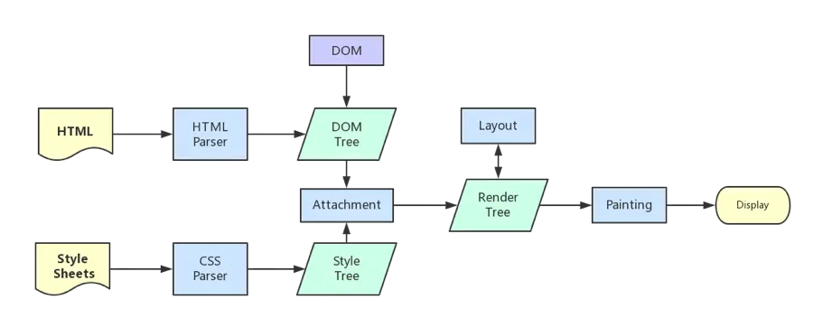
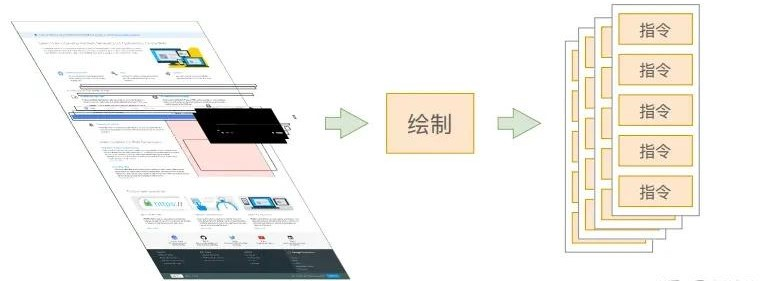

# 页面渲染流程

`浏览器渲染进程`（浏览器内核）拿到内容后，渲染步骤大致可以分为以下几步：

- 解析 HTML：解析 HTML 并构建 DOM 树
- 解析 CSS：解析 CSS 并构建 CSSOM 树（样式树）
- 合成渲染树：将`DOM`与`CSSOM`合并成一个`Render Tree`（渲染树）
- 布局计算：根据渲染树的解构，计算每个`节点`在屏幕上的`大小、位置`等属性，生成布局信息 Layout。这个过程会发生`回流和重绘`
- 分层：创建复合图层，进行`硬件加速`，提高性能
- 绘制页面：将生成的`布局信息`交给浏览器的`绘图引擎`，通过 GPU 加速将像素`Paint`到屏幕上
- 回流和重绘：如果页面发生`改变`，浏览器需要重新计算布局和绘制，这可能导致`性能`问题。因此我们应`尽量避免频繁的DOM操作和调整元素样式`，以减少不必要的回流和重绘。

  

## 1、解析 HTML，构建 DOM 树

- 解析过程中遇到 CSS 解析 CSS、遇到 JS 执行 JS，为了提高解析效率，浏览器在开始解析前会启动一个`预解析的线程`，率先下载 HTML 中的`外部CSS`和`外部JS`文件。
- 如果主线程解析到 `link` 位置，此时外部 CSS 文件还没下载解析好，主线程不会等待，继续解析后续的 HTML。这是因为 CSS 的下载解析工作是在预解析线程中进行的，这就是 `CSS 不会阻塞 HTML` 解析的根本原因。
- 如果主线程解析到 `script` 位置，会停止解析 HTML。这是因为 JS 代码的执行过程可能会修改当前的 DOM 树，所以 DOM 树的生成必须暂停。这就是 `JS 会阻塞 HTML` 解析的根本原因。

- 将 HTML 转为 DOM 树

  

  > 1、将字符串转换成 Token，例如：`<html>、<head>、<body>`等。Token 中会标识出当前 Token 是 “开始标签” 或是 “结束标签” 亦或是 “文本” 等信息

  > 2、构建 DOM 的过程中，不是等所有 Token 都转换完成后再去生成节点对象，而是`一边生成 Token，一边消耗 Token 来生成节点对象`。换句话说，每个 Token 被生成后，会立刻消耗这个 Token 创建出节点对象。注意：带有结束标签标识的 Token 不会再去创建节点对象。

## 2、解析 CSS，构建 CSSOM 树

- 构建 CSSOM 树的过程与构建 DOM 树的过程非常相似，同样`字节 -> 字符串 -> Token -> Node -> CSSOM`
- `CSS匹配HTML元素`是一个相当复杂且有性能问题的事情，浏览器要递归`CSSOM`树，确定每一个节点的样式到底是什么。所以 DOM 树要小，CSS 尽量用`id`和`class`，切勿过度层叠下去。

## 3、合成渲染树（样式计算）

- 当我们得到`DOM`树和`CSSOM`树后，就需要将这两棵树组合为`Render tree`
- 这一过程结束后，渲染树只会包含需要显示的`节点`和这些节点的`样式`信息，若某个节点是`display: none`的，那么就不会出现在渲染树中
- 主线程会遍历 DOM 树，依次为树中的每个节点计算出它最终的样式，这一过程称为`Computed Style`。在这一过程中很多预设值会变成绝对值：如`red -> rgb(255, 0, 0)`、`em -> px`等

## 4、布局

- 浏览器生成`渲染树`以后，就会根据渲染树来进行布局（也叫`回流` ）。布局阶段浏览器会弄清楚各个节点在页面中的确切 `位置`和`大小`，这一行为也被称为`自动重排`
- 布局流程的输出是一个**盒模型**，所有`相对测量值`都将转换为`屏幕上的绝对像素`
- **大部分时候，DOM 树和布局树并非一一对应。** 比如:

  - `display:none` 的节点没有几何信息，因此不会生成到布局树；
  - `伪元素选择器`，虽然 DOM 树中不存在这些伪元素节点，但它们拥有几何信息，所以会生成到布局树中。
  - `匿名行盒`、`匿名块盒`等都会导致 DOM 树和布局树无法一一对应。

  
  

## 5、分层（普通图层、复合图层）

- 主线程会使用一套复杂的策略对整个布局树中进行分层。 分层的好处在于，`将来某一个层改变后，仅会对该层进行后续处理，从而提升效率`。`滚动条、堆叠上下文、transform、opacity` 等样式都会或多或少的影响分层结果，也可以通过`will-change`属性更大程度的影响分层结果。
- 可通过`f12 -> 更多工具 -> layers` 查看分层情况

---

- `普通图层`：
  - `普通文档流`内可以理解为一个复合图层（这里称为`默认复合层`，里面不管添加多少元素，其实都是在同一个复合图层中）
  - absolute 布局（fixed 也一样），虽然可以脱离普通文档流，但它仍然属于默认复合层
- `复合图层`：

  - 可以通过`硬件加速`方式，声明一个新的复合图层，它会单独分配资源。（当然也会脱离文档流，这样一来，不管这个复合图层中怎么变化，也不会影响`默认复合层`里的回流重绘）
  - **在 GPU 中，各个复合图层是单独绘制的，所以互不影响**，这也是为什么某些场景硬件加速效果一级棒。
  - 可以`Chrome源码调试 -> More Tools -> Rendering -> Layer borders`中看到，黄色的就是复合图层信息。

- 如何变成复合图层（硬件加速，提升性能）？

  - 最常用的：`translate3d`、`translateZ`
  - `opacity属性/过渡动画`：需要动画执行的过程中才会创建合成层，`动画未开始、动画结束后`元素还会回到之前的状态
  - will-change 属性（这个比较偏僻）：一般配合 opacity 和 translate 使用，作用是提前告诉浏览器要变化，这样浏览器会开始做一些优化工作（最好用完后就释放）
  - `<video>、<iframe>、<canvas>、<webgl>`等元素
  - 其他：如以前的 flash 插件

- `尽量不要大量使用复合图层，否则由于资源消耗过度，页面反而会变的更卡`

- 使用硬件加速时，尽可能的使用 index，防止浏览器默认给后续的元素创建复合层渲染
  - `webkit CSS3`中，如果这个元素添加了硬件加速，并且`index`层级比较低，那么在这个元素的后面其它元素（层级比这个元素高的，或者相同的，并且 releative 或 absolute 属性相同的），会默认变为复合层渲染，如果处理不当会极大的影响性能
  - 隐式合成的概念：`如果a是一个复合图层，而且b在a上面，那么b也会被隐式转为一个复合图层`

## 6、绘制页面

- 主线程会为每个层单独产生`绘制指令集`，用于描述这一层的内容该如何画出来。

  

- 完成绘制后，主线程将每个图层的绘制信息提交给`合成线程`，剩余工作将由合成线程完成
- 合成线程首先`对每个图层进行分块`，将其划分为更多的小区域。 它会从线程池中拿取多个线程来完成分块工作。

  

## 7、回流和重绘

- `回流`的本质是重新计算`layout`树。当进行了影响布局树的操作后，会引发布局计算。为避免连续的多次操作导致布局树反复计算，浏览器会合并这些操作，`待JS代码全部执行完成后再进行统一计算`。所以改动属性造成的回流是`异步`完成的。

  > 因此，当 JS 获取布局属性时，就可能无法获取最新的布局信息。浏览器在反复权衡下，最终决定`获取属性（如dom.clientWidth）立即回流`

- `重绘`的本质是重新根据`分层信息`计算了`绘制指令`。当改动了`可见样式`后，就需要重新计算，引发重绘

  > 由于元素的布局信息也属于可见样式，所以`回流一定会引起重绘`

- 总结：

  - 回流也叫重排，当 `DOM结构发生变化` 或者 `元素样式发生改变`时，浏览器需要重新计算样式和渲染树，这个过程比较`消耗性能`
  - 重绘，指`元素的外观样式发生变化`（比如改变 背景色，边框颜色，文字颜色 color 等 ），但是布局没有变，此时浏览器只需要应用新样式绘制元素就可以了，比回流消耗的性能小一些

- 什么情况会引起回流？

  - **页面的首次渲染、浏览器的窗口大小发生变化、元素内容发生变化、元素的尺寸或位置发生变化、元素的字体大小发生变化、添加或删除可见的 `DOM元素`、激活 `CSS伪类`、查询某些属性或者调用某些方法**

  - 优化方案：
    - `使用 CSS 动画代替 JavaScript 动画`：CSS 动画利用 GPU 加速，在性能方面通常比 JavaScript 动画更高效。使用 CSS 的 transform 和 opacity 属性来创建动画，而不是改变元素的布局属性，如宽度、高度等。
    - `使用 translated3d 开启硬件加速`：将元素的位移属性设置为 translated3d( 0,0,0 )，可以强制使用 GPU 加速。有助于避免回流，并提高动画流畅度。
    - `避免频繁操作影响布局的样式属性`：当需要对元素进行多次样式修改时，可以考虑将这些修改合并为一次操作。通过添加/移除 css 类来一次性改变多个样式属性，而不是逐个修改。
    - `使用 requestAnimationFrame`：通过使用 requestAnimationFrame 方法调度动画帧，可以确保动画在浏览器的重绘周期内执行，从而避免不必要的回流。这种方式可确保动画在最佳时间点进行渲染。
    - `使用文档片段（Document Fragment）`：当需要在 DOM 中插入大量新元素时，可以先将这些元素添加到文档片段中，然后再将整个文档片段一次性插入到 DOM 中。这样可以减少回流和重绘的次数。（vue 虚拟 dom 的做法）
    - `使元素脱离文档流`：position: absolute/position: fixed/float:left（只是减少回流，不是避免回流）
    - `使用 visibility:hidden 代替 display: none`：visibility:hidden 不会触发回流，因为元素仍然占据空间，只是不可见。而 display: none 会将元素从渲染树中移除，引起回流。

## 8、注意事项

1. `CSSOM 会阻塞渲染`，只有当 CSSOM 构建完毕后才会进入下一个阶段构建渲染树。（这点与浏览器优化有关，防止 css 规则不断改变，避免了重复的构建）(CSS 加载虽然不会阻塞 DOM 树解析，但会阻塞 Render 树的渲染)

2. `通常情况下 DOM 和 CSSOM 是并行构建的`，但是`当浏览器遇到一个 script 标签时，DOM 构建将暂停`，直至 JS 脚本下载完成并执行后才会继续解析 HTML。因为 JavaScript 可以使用诸如 document.write() 更改整个 DOM 结构之类的东西来更改文档的形状，因此 HTML 解析器必须等待 JavaScript 运行才能恢复 HTML 文档解析。

3. 如果你想首屏渲染的越快，就越不应该在首屏就加载 JS 文件，`建议将 script 标签放在 body 标签底部`。

4. 如果主线程解析到 link 位置，此时外部的 CSS 文件还没有下载解析好，主线程不会等待，继续解析后续的 HTML。这是因为`下载和解析 CSS 的工作是在预解析线程中进行的`。这就是`CSS 不会阻塞 HTML 解析`的根本原因。
