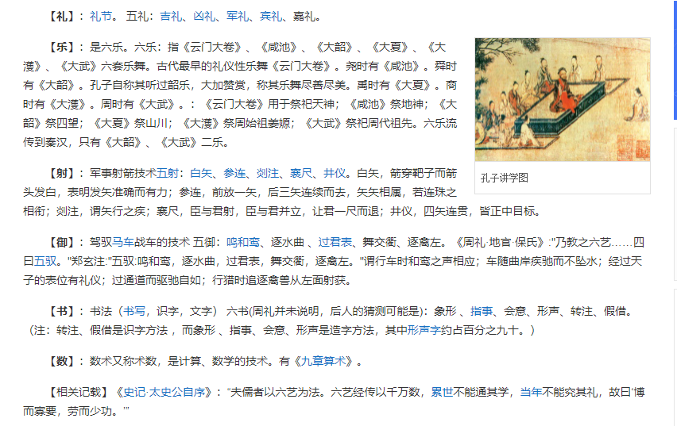
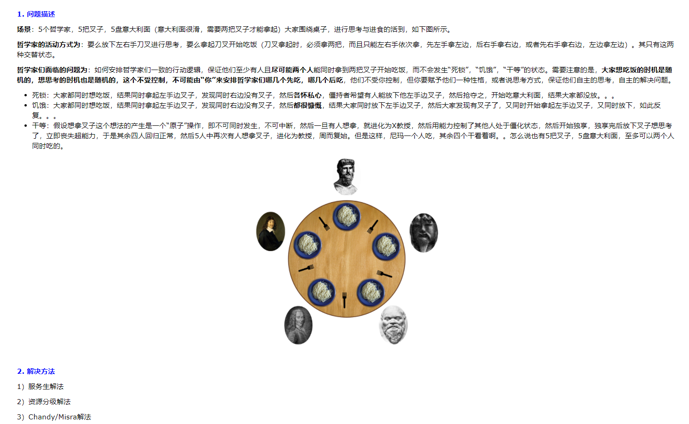

# 杂记

## 1、身体健康值

- 舒张压：60-89mmHg
- 收缩压：90-139mmHg
- 呼吸：12-20 次/min
- 脉搏：60-100 次/min
- 血氧饱和度：95%-98%

## 2、常识

- 一个标准大气压：101.325kPa

- `1平方千米`=`100公顷`=`10000公亩`＝`1000000平方米`
- `1^2` `10^2` `100^2` `1000^2`

- `1公顷`=`15亩`=`100公亩`=`10000平方米` `1(市)亩等于666.66平方米`
- `1顷` = `100亩`

- 相机：万元以下的 2420 万像素、万元以上的 4240 万像素（ `200万像素-1920*1080`）

## 3、杂记

- 明月别枝惊鹊，清风半夜鸣蝉

- 阎王（民间神话）、阎罗王（佛教，十殿阎罗之一）------ 可拍一部国漫
- 阎：里巷的门（古代五家为邻，五邻为里）
- 式微：式，发语词。微，衰落。借指国家或世族衰落，也泛指事物衰落：家道～。制造业日趋～

## 4、中国气候类型

- 热带雨林、热带季风、亚热带季风、温带季风、温带大陆、高原山地

- 三山夹两盆：阿尔泰山、天山、昆仑山-----准噶尔盆地、塔里木盆地

## 5、六艺

## 6、哲学家问题

