# 欧洲建筑风格

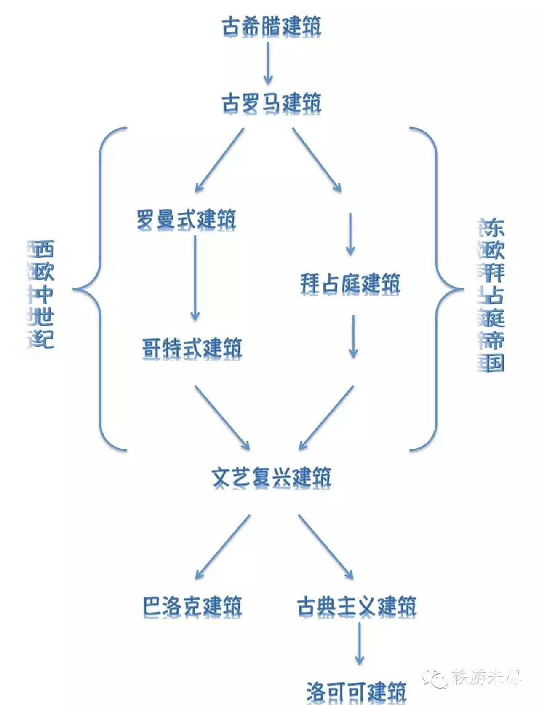

## 1、希腊式建筑（三角门楣+棍子）

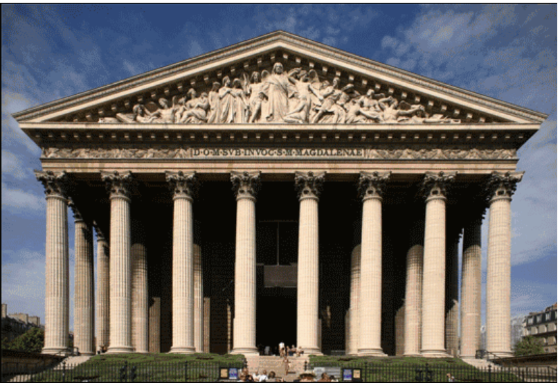

## 2、罗马式建筑（大圆顶、大拱门）

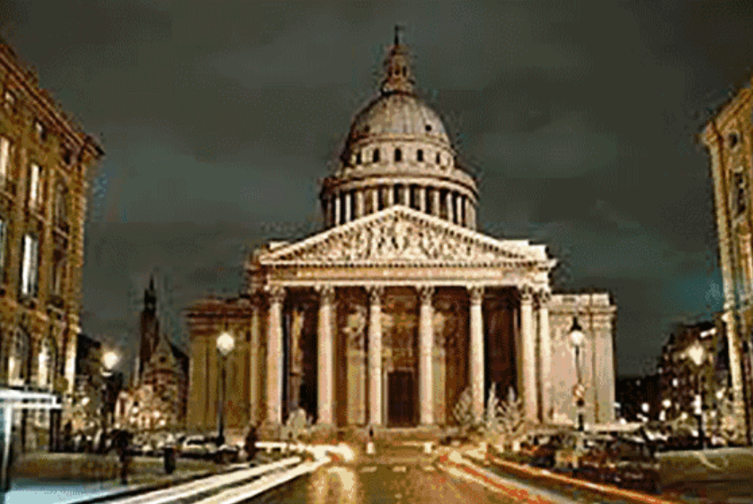
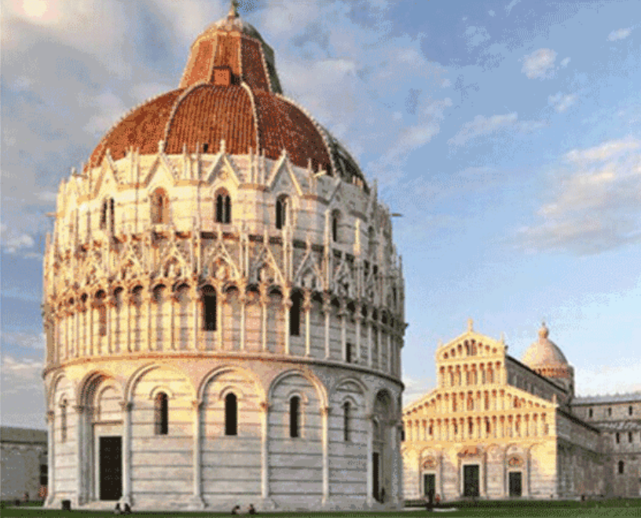
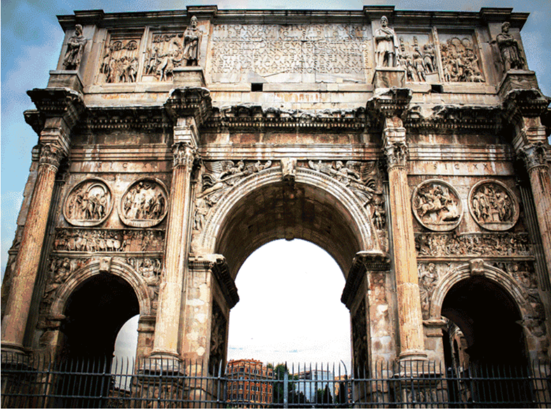

## 3、拜占庭式建筑（洋葱头）

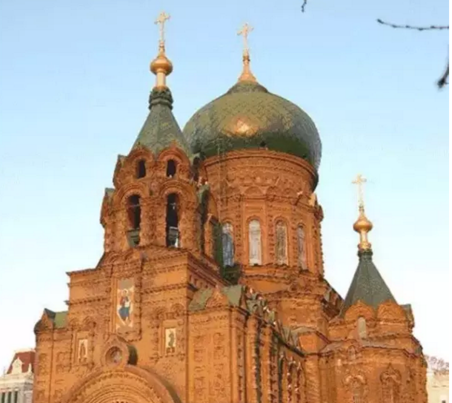
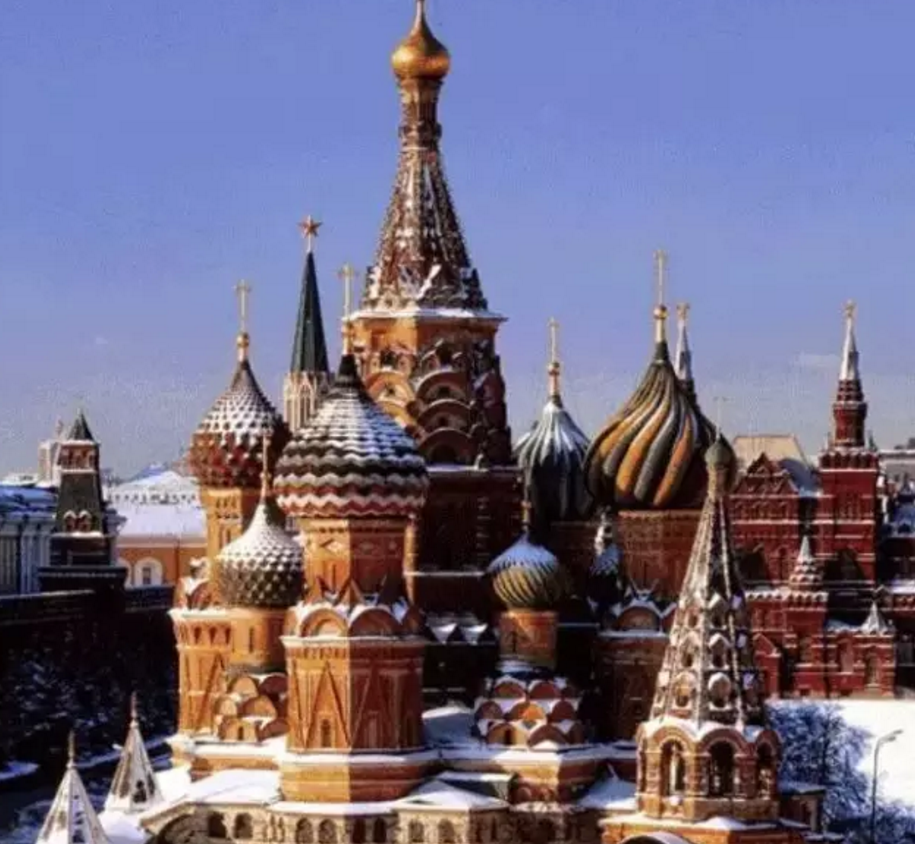

## 4、哥特式建筑（天主教盛行，高、骨感）

## 5、文艺复兴式建筑（左右对称）

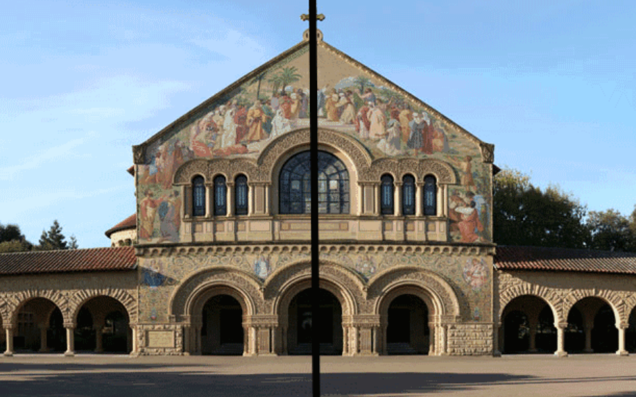

## 6、巴洛克式风格（建筑、家具、服装）（特点：金色）

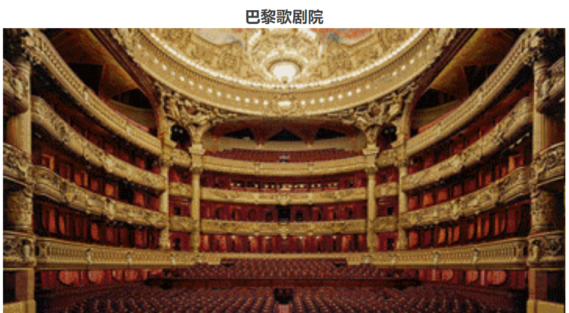

## 7、洛可可式风格（室内）（巴洛克2.0，更加奢华）

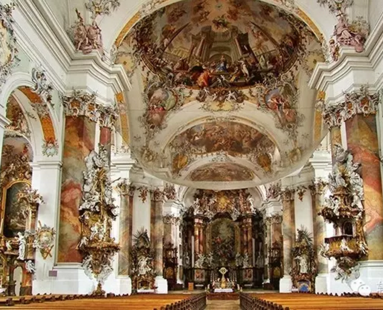

## 8、德国山形墙（冬天让雪滑落）

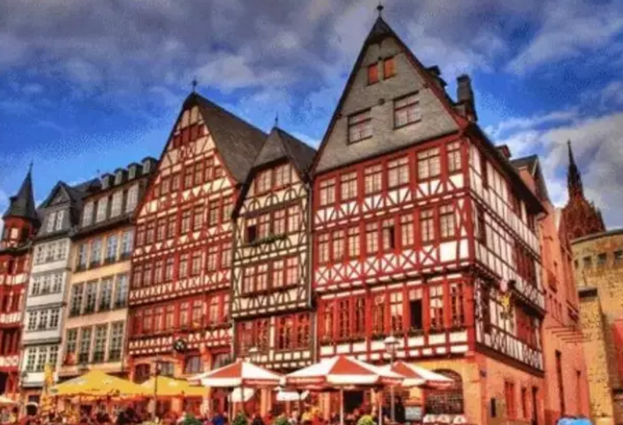

## 9、地中海式建筑（平顶式建筑，白、蓝，散热）

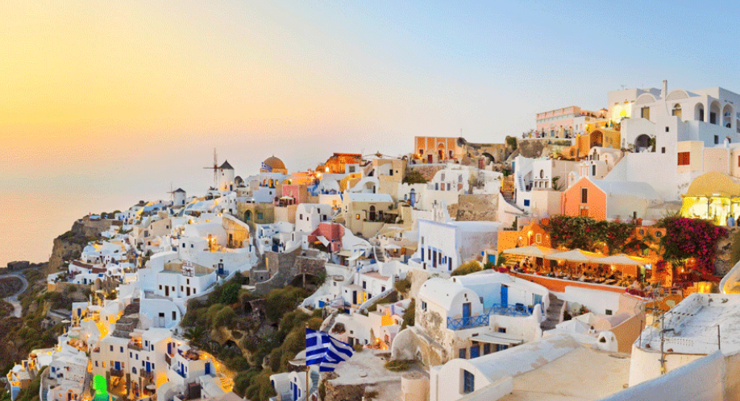
